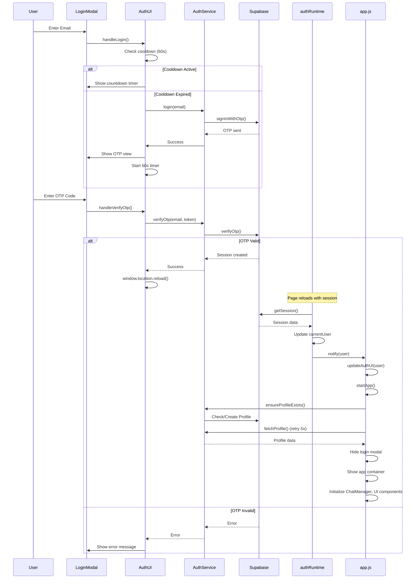

# 🔐 Authentication System

## Overview

MakiX Enterprise implements a **passwordless authentication system** using Supabase Auth with **email-based OTP (One-Time Password)** verification. The system provides a secure, streamlined login experience with automatic session management and profile creation.

---

## 🏗️ Architecture

### Core Components

1. **AuthUI** (`app/src/js/ui/AuthUI.js`)
   - Manages the login modal UI and user interactions
   - Handles email input, OTP verification, and resend logic
   - Implements rate-limiting with visual countdown timers

2. **AuthService** (`app/src/js/core/AuthService.js`)
   - Core authentication logic and API calls
   - Profile management and session handling
   - Supabase integration layer

3. **authRuntime** (`app/src/js/authRuntime.js`)
   - Global authentication state management
   - Event-driven user change notifications
   - Session bootstrapping and refresh logic

4. **app.js** (`app/src/js/app.js`)
   - Application initialization orchestration
   - Auth state-driven UI transitions
   - Startup resilience and error handling

---

## 🔄 Authentication Flow



---

## 📋 Detailed Flow Steps

### 1️⃣ **Login Initiation**

**User Action:** Enters email address and clicks "Send Access Code"

**Process:**
1. `AuthUI.handleLogin()` validates the email input
2. Checks for existing cooldown in `localStorage` (60-second rate limit)
3. If cooldown active, shows countdown timer and switches to OTP view
4. If cooldown expired, calls `AuthService.login(email)`
5. `AuthService` calls Supabase `signInWithOtp()` with `shouldCreateUser: true`
6. Stores timestamp in `localStorage` as JSON: `{email, timestamp}`
7. Switches UI to OTP verification view
8. Starts 60-second countdown timer on both "Send" and "Resend" buttons

**Rate Limiting:**
- Client-side: 60-second cooldown enforced via `localStorage`
- Visual feedback: Buttons show "Wait Xs" countdown
- Resend button disabled during cooldown

---

### 2️⃣ **OTP Verification**

**User Action:** Enters 6-digit OTP code and clicks "Verify & Enter"

**Process:**
1. `AuthUI.handleVerifyOtp()` retrieves email from `localStorage`
2. Validates OTP input (non-empty)
3. Shows loading state on verify button ("Verifying...")
4. Calls `AuthService.verifyOtp(email, token)`
5. Supabase validates the OTP and creates a session
6. On success: `window.location.reload()` for clean state reset
7. On error: Shows error modal and re-enables verify button

**Why Reload?**
- Ensures all global state is reset
- Prevents race conditions in initialization
- Guarantees fresh session data from Supabase
- Clears any stale UI state

---

### 3️⃣ **Session Bootstrap**

**Triggered by:** Page load after successful OTP verification

**Process:**
1. `authRuntime.bootstrapAuth()` runs on `DOMContentLoaded`
2. Calls `supabase.auth.getSession()` to retrieve active session
3. Updates `currentUser` with session data
4. Notifies all listeners via `notify(currentUser)`
5. `app.js` receives notification through `onUserChange(updateAuthUI)`

**Listeners:**
- Supabase `onAuthStateChange` for real-time updates
- Manual `bootstrapAuth()` for initial page load
- `refreshAuthState()` for mobile compatibility

---

### 4️⃣ **Application Initialization**

**Triggered by:** `updateAuthUI(user)` when user is authenticated

**Process:**
1. `startApp()` checks if already initialized (prevents double-init)
2. Creates core UI managers: `ModalUI`, `RealtimeCallUI`, `RealtimeCallManager`
3. Calls `AuthService.ensureProfileExists()`:
   - Checks if profile exists in `chatbot_app.profiles`
   - If not found (PGRST116 error), creates profile with user ID and email
4. Fetches profile with retry logic (5 attempts, exponential backoff):
   - Handles database consistency lag
   - Each retry waits 1s, 2s, 3s, 4s, 5s
5. Checks API configuration and triggers auto-connect if needed
6. On success:
   - Hides login modal (`display: none`)
   - Shows app container (`display: flex`)
   - Clears `login_email_sent_to` from `localStorage`
   - Initializes `ChatManager`, `ChatUI`, `SidebarUI`, etc.
   - Loads user sessions and renders dashboard
7. On failure:
   - Reverts to login modal
   - Resets initialization flags
   - Allows retry on next auth state change

**Resilience Features:**
- Double-init protection via `isInitializing` flag
- Retry logic for profile fetching (handles DB lag)
- Explicit UI state management (no reliance on CSS classes alone)
- Error recovery with automatic rollback

---

## 🗄️ Database Schema

### Profiles Table

```sql
CREATE TABLE chatbot_app.profiles (
    id uuid PRIMARY KEY REFERENCES auth.users(id) ON DELETE CASCADE,
    email TEXT UNIQUE NOT NULL,
    name TEXT,
    enterprise_name TEXT,
    role TEXT,
    timezone TEXT,
    system_prompt TEXT,
    api_endpoint TEXT,
    api_token TEXT,
    api_model_text TEXT,
    api_model_vision TEXT,
    api_model_image TEXT,
    api_model_asr TEXT,
    api_model_tts TEXT,
    api_model_embedding TEXT,
    tts_voice TEXT,
    api_model_agent TEXT,
    api_model_voice TEXT,
    op_max_steps INTEGER DEFAULT 10,
    op_context_limit_tokens INTEGER DEFAULT 14000,
    op_tool_output_limit_tokens INTEGER DEFAULT 1500,
    op_user_input_limit_tokens INTEGER DEFAULT 1500,
    op_max_tool_calls_per_step INTEGER DEFAULT 5,
    op_max_total_tool_calls INTEGER DEFAULT 20,
    op_idle_threshold_seconds INTEGER DEFAULT 120,
    op_cron_interval_seconds INTEGER DEFAULT 30,
    created_at TIMESTAMPTZ DEFAULT NOW(),
    updated_at TIMESTAMPTZ DEFAULT NOW()
);
```

### Automatic Profile Creation

**Trigger:** `on_auth_user_created`

```sql
CREATE TRIGGER on_auth_user_created
  AFTER INSERT ON auth.users
  FOR EACH ROW EXECUTE PROCEDURE chatbot_app.handle_new_user();
```

**Function:**
```sql
CREATE OR REPLACE FUNCTION chatbot_app.handle_new_user()
RETURNS TRIGGER AS $$
BEGIN
  INSERT INTO chatbot_app.profiles (id, email)
  VALUES (new.id, new.email);
  RETURN new;
END;
$$ LANGUAGE plpgsql SECURITY DEFINER;
```

---

## 🔒 Security Features

### Row-Level Security (RLS)

```sql
ALTER TABLE chatbot_app.profiles ENABLE ROW LEVEL SECURITY;

CREATE POLICY "Allow users to manage their own profile"
ON chatbot_app.profiles
FOR ALL USING (auth.uid() = id) WITH CHECK (auth.uid() = id);
```

**Protection:**
- Users can only access their own profile
- Enforced at database level
- Prevents unauthorized data access

### Rate Limiting

**Client-Side:**
- 60-second cooldown between OTP requests
- Stored in `localStorage` with timestamp
- Visual countdown feedback

**Server-Side:**
- Supabase enforces rate limits on OTP generation
- Prevents abuse and spam

### Session Management

**Persistence:**
- Sessions stored in browser `localStorage`
- Auto-refresh enabled via Supabase client config
- JWT tokens automatically renewed

**Security:**
```javascript
export const supabase = createClient(SUPABASE_URL, SUPABASE_ANON_KEY, {
    db: { schema: 'chatbot_app' },
    auth: {
        persistSession: true,
        autoRefreshToken: true,
    }
});
```

---

## 🎨 UI Components

### Login Modal Structure

```
loginModal (fixed overlay)
├── login-premium-bg (animated background)
│   ├── login-blob-1 (primary light)
│   ├── login-blob-2 (purple)
│   └── login-blob-3 (indigo)
├── loginView
│   ├── Logo + Branding
│   ├── Email Input
│   └── Send Access Code Button
└── verifyOtpView (hidden by default)
    ├── OTP Code Input
    ├── Verify & Enter Button
    ├── Resend Code Link
    └── Change Email Link
```

### Premium Background

**CSS Classes:**
- `.login-premium-bg`: Radial gradients overlay
- `.login-blob`: Animated floating blobs
- Keyframe animation: `blob-float` (20-30s infinite)

**Visual Effect:**
- Subtle animated background
- Glass-morphic card design
- Smooth transitions between views

---

## 🛠️ State Management

### LocalStorage Keys

| Key | Format | Purpose |
|-----|--------|---------|
| `login_email_sent_to` | `{email: string, timestamp: number}` | Rate limiting & OTP state |
| `autoconnect_email_sent` | `string` | LLM provider auto-connect tracking |
| `autoconnect_verified` | `string` | Completed auto-connect flag |
| `hideTutorial` | `'true'` | Tutorial modal preference |

### Global State

**authRuntime.js:**
```javascript
let currentUser = null;           // Current authenticated user
const listeners = new Set();      // Auth state change listeners

function notify(user) {
  for (const fn of listeners) fn(user);
}
```

**app.js:**
```javascript
let isAppInitialized = false;     // Prevents double initialization
let isInitializing = false;       // Prevents concurrent init attempts
```

---

## 🐛 Error Handling

### Common Scenarios

#### 1. **Profile Not Found After Login**

**Symptom:** User stuck on login screen after OTP verification

**Cause:** Database consistency lag between auth and profile creation

**Solution:**
- Retry logic with exponential backoff (5 attempts)
- Each attempt waits progressively longer (1s → 5s)
- Handles eventual consistency in Supabase

#### 2. **Session Expired**

**Symptom:** JWT expired error during API calls

**Cause:** Long-lived session without refresh

**Solution:**
```javascript
if (error.message?.includes('JWT expired')) {
    await supabase.auth.refreshSession();
    // Retry operation
}
```

#### 3. **OTP Cooldown Bypass**

**Symptom:** User clicks "Send" multiple times rapidly

**Solution:**
- Client-side timestamp check
- Server-side rate limiting (Supabase)
- Visual countdown timer

---

## 📱 Mobile Considerations

### Session Persistence

**Challenge:** Mobile browsers may delay `onAuthStateChange` events

**Solution:**
```javascript
setTimeout(async () => {
    const refreshed = await refreshAuthState();
    if (refreshed) {
        console.log('Auth state manually refreshed for mobile');
    }
}, 300);
```

### UI Responsiveness

- Responsive modal sizing (`max-w-sm`, `p-4`)
- Touch-friendly button sizes (min 44x44px)
- Adaptive typography (`text-sm` → `text-base`)

---

## 🚀 Future Enhancements

### Planned Features

1. **Social Login**
   - Google OAuth integration
   - GitHub authentication
   - Apple Sign In

2. **Multi-Factor Authentication**
   - TOTP (Time-based OTP)
   - SMS verification
   - Biometric authentication

3. **Session Management**
   - Active sessions list
   - Remote logout
   - Device tracking

4. **Enhanced Security**
   - IP-based rate limiting
   - Suspicious activity detection
   - Account recovery flow

---

## 📚 References

- [Supabase Auth Documentation](https://supabase.com/docs/guides/auth)
- [OTP Best Practices](https://cheatsheetseries.owasp.org/cheatsheets/Multifactor_Authentication_Cheat_Sheet.html)
- [Row-Level Security Guide](https://supabase.com/docs/guides/auth/row-level-security)

---

## 🔗 Related Documentation

- [Agentic Framework](./Agentic.md)
- [Database Schema](../app/schema.sql)
- [API Configuration](./agentic/Intelligence.md)
