# 🧠 Cowork AI Technical Conceptual Framework

This document outlines the core architectural pillars and cognitive strategies of the Cowork Agentic System. It serves as a blueprint for understanding how the agent manages massive context, reasons through complex tasks, and ensures operational safety.

---

## 🏗️ 1. Context Window Management
*Managing "Infinite" windows within finite LLM constraints.*

The system uses a multi-tiered approach to ensure the agent never "chokes" on large data while maintaining high factual integrity.

### 🖇️ Map-Reduce Compression
When the conversation history exceeds the sliding window buffer (default 6,000 tokens), the **Context Compressor** activates:
1.  **Map Phase**: Larger history is fragmented into semantic chunks (paragraphs/sentences). Each chunk is summarized by a high-speed model at **Temperature 0.1** to preserve numerical and factual data.
2.  **Reduce Phase**: The summaries are synthesized into a dense **[CONVERSATION SUMMARY]** block.
3.  **Protection**: The **System Identity** and the **Last 2 Human Messages** are strictly excluded from compression to maintain current conversational flow.

### 📝 The Scratchpad (Pass-by-Reference)
The Scratchpad is a volatile "Work-RAM" for the agent. It implements a **Pass-by-Reference** strategy:
- **Offloading**: When the Input Gatekeeper detects a payload larger than the limit, it offloads it to disk.
- **Pointers**: The LLM receives a lightweight `ref:key` (e.g., `ref:input_a1b2`).
- **Resolution**: Data is only "inlined" at the exact moment of tool execution, preventing context bloat.

### 🥪 Sandwich Previews
For massive data that must be seen but not fully read, the system uses a **Sandwich Reduction**:
- 🟢 **Head**: High-fidelity introduction.
- 🟡 **Middle**: Omitted with a `[CONTENT OFFLOADED]` marker.
- 🔴 **Tail**: Conclusion/Footer data.

```mermaid
graph TD
    A[🏁 Step Start] --> B{🚦 Tokens > Buffer?}
    B -- No --> C[🏃 Execute Turn]
    B -- Yes --> D[🔍 Identify Heavy History]
    
    subgraph "Compression Phase (Map-Reduce)"
        D --> E[✂️ Smart Chunking]
        E --> F["Fragment 1..N (Boundaries)"]
        F --> G[🧠 LLM Map: Summarize]
        G --> H[📦 Combined Result]
        H --> I["📉 LLM Reduce: De-duplicate"]
    end
    
    I --> J[📝 Generate Summary Block]
    J --> K["💉 Inject [CONVERSATION SUMMARY]"]
    K --> L[🧹 Prune History]
    L --> M[🔄 Resume REACT Loop]
```

---

## 🧭 2. Tool Call Strategy
*Dynamic Schema discovery and intelligent routing.*

### 🧠 Meta-Routing (Phase 2)
To prevent "Tool Fatigue" and noise, the system uses a **Meta-Router** to classify intent before the main loop starts:
- **Mode**: Runs at **Temperature 0.0** with **JSON Mode** for maximum structure.
- **Efficiency**: Filters 40+ available tools down to 3-5 relevant domain-specific tools (e.g. `WEB_TOOLS`, `DATA_AND_UTILITY`).
- **Fallbacks**: If LLM routing fails or has low confidence, it falls back to **Keyword-based routing** or **ALL_TOOLS** access.

### 🛡️ Tool Firewall
The **Firewall Manager** intercepts every tool call before execution:
- **Actions**: `ALLOW` (Auto-run), `BLOCK` (Hard rejection), `ASK` (Requires user confirmation).
- **Rules**: Powered by `firewall.yaml`, allowing regex-based field validation (e.g., "Only allow emails to @company.com").

```mermaid
graph TD
    A["👤 User Prompt"] --> B{"🧭 Meta-Router"}
    B -- "Hello" --> C["💬 Conversational (0 Tools)"]
    B -- "Research AI" --> D["🌍 Load SEARCH Tools"]
    B -- "Analyze Image" --> E["👁️ Load VISION Tools"]
    B -- "Low Confidence" --> G["🔥 Load ALL Tools"]
    C --> F("🤖 LLM Execution")
    D --> F
    E --> F
    G --> F
    F --> H["✅ Final Response"]
```

---

## 📊 3. Evaluation
*Performance tracking and goal assessment.*

### 🕵️ Agent Trace & Telemetry
Every execution is recorded in an **Agent Trace**. This includes:
- **Step-by-step elapsed time** (ms).
- **Input/Output JSON** for every tool call.
- **API usage metrics** (tokens, model, cost).

### 🎯 Goal Assessment (Step Budget Awareness)
The agent is governed by a **Step Budget** (default 15 steps). If the budget is nearing exhaustion:
1.  **Self-Assessment**: The system injects a `[SYSTEM NOTICE]` forcing the agent to evaluate its progress.
2.  **Status Reporting**: The agent must output one of: `✅ GOAL ACHIEVED`, `⚠️ GOAL PARTIALLY ACHIEVED`, or `❌ GOAL NOT ACHIEVED`.
3.  **Handoff**: It provides a summary of "What stays" and "What next" so the user can decide to continue.

---

## 💡 4. Reasoning
*The REACT (Reason-Act) execution engine.*

The reasoning engine follows the **Manager-Worker** pattern where the "Manager" (Agent) decides on tools and the "Worker" (Executor) handles the dirty work.

### 🔄 REACT Loop
1.  **Reason**: Analyze current history + memory + scratchpad index.
2.  **Act**: Generate one or more tool calls (Parallelized if independent).
3.  **Observation**: Receive tool output (Sandwiched or Referenced).
4.  **Repeat**: Iterate until the final answer is reached or the step limit is hit.

### ⚓ Multi-Step Task Anchoring
For long-running tasks, the agent uses a **Task Anchor** in the scratchpad (key: `task_goal`). This ensures that even if context is compressed, the **original objective, scope, and current state** remain visible in every turn.

```mermaid
sequenceDiagram
    autonumber
    participant User as 👤 User
    participant CM as 📑 ChatManager
    participant Agent as 🤖 General Agent
    participant Router as 🧭 Meta-Router
    participant API as 📡 LLM API
    participant Tools as ⚙️ Tool Executor

    User->>CM: Request
    CM->>Router: Classify Intent
    Router-->>Agent: Strategy + Tool Schemas
    
    loop REACT Cycle
        Agent->>API: Reasoning Step (T=0.4)
        API-->>Agent: Decision: Call Tool X
        Agent->>Tools: Execute
        Tools-->>Agent: Result (Observation)
    end
    
    Agent-->>User: Final Result
```

---

## 🧠 5. Long Term Memory (Personalization)
*The Memoria framework: Hybrid Semantic Knowledge.*

Memoria provides the agent with a "Past" and a "Personality" using a hybrid Knowledge Graph and Vector search approach.

### 🧩 Knowledge Graph Triplets
The system extracts durable facts into **Triplets** (Subject-Predicate-Object).
- *Example*: `(User, prefers, Python)`, `(User, lives_in, Berlin)`.
- **Fused Context**: Before every turn, the system performs a semantic search for relevant triplets and injects them as **[PERSONA KNOWLEDGE]**.

### ⏰ Temporal Decay (EWA)
Memory is not static. It uses **Exponentially Weighted Average (EWA)** to decay the relevance of older facts:
- **Similarity**: Vector distance from the current query.
- **Recency**: Time delta since the fact was created.
- **Formula**: `weight = similarity * exp(-decay_rate * minutes_elapsed)`.

```mermaid
graph TB
    subgraph "Read Path"
        A[👤 Query] --> B{🔍 Semantic Search}
        B --> C[(SQL Triplets)]
        B --> D[(Vector DB)]
        C & D --> E[⏰ EWA Decay]
        E --> F[💉 Injected Context]
    end
    
    subgraph "Write Path"
        G[🤖 Interaction] --> H[🧠 Fact Extraction]
        H --> I[(Upsert Triplets)]
        I --> J[📦 Rebuild Vector Index]
    end
```

---

## 🛡️ 6. Security & Guardrails
*Operational boundaries and safety middleware.*

### 🚧 Execution Gateways
Before code or tools run, the **Execution Gateway** performs strict validation:
- **Schema Validation**: Ensures arguments match expected types.
- **Reference Resolution**: Securely swaps `ref:key` for real data only within the tool's process.
- **Fail-Fast**: Malformed calls are blocked with an **Actionable Hint** (e.g., `[HINT]: Enclose the value in quotes`).

### 🧘 Half-Halt Protocol (The Recovery Strategy)
When errors occur, the system provides "Actionable Intelligence" to the agent:
- **[GATEWAY ERROR]**: Agent assumes responsibility and fixes parameters.
- **[TOOL ERROR]**: Agent pivots to a fallback tool or clarifies with the user.
- **Loop Detection**: If an agent repeats the same tool call with the same arguments twice, the system breaks the loop and forces user interaction.

```mermaid
graph LR
    A[🤖 Tool Call] --> B{🚧 Gateway}
    B -- Malformed --> C[🩹 Auto-Hint]
    B -- Valid --> D{🛡️ Firewall}
    D -- Ask --> E[👤 User Confirm]
    D -- Deny --> F[❌ Policy Block]
    D -- Allow --> G[⚙️ Execution]
    G --> H[✅ observation]
```

