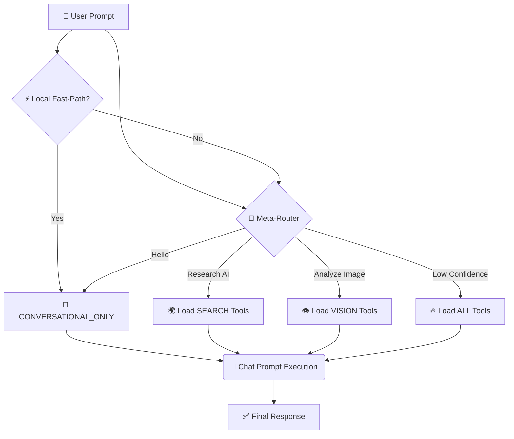

# 🧠 Intelligence & Reasoning

This document details the cognitive strategies used to maximize accuracy while minimizing latency and token costs.

---

## 🧭 Meta-Tool Routing (The Brain)
To prevent "Tool Fatigue" and context noise, we implement a **Dynamic Schema** strategy powered by a dedicated Router agent.

### 🚦 The Logic Flow (Current)
1.  **⚡ Local Fast-Path Check**: For short conceptual turns, the agent routes directly to `CONVERSATIONAL_ONLY`.
2.  **🔍 Router Classification**: If not fast-pathed, run a **T=0.0** routing call with JSON output.
3.  **🎚️ Tool-Need Calibration**: Apply a probability gate; low tool-need can force `CONVERSATIONAL_ONLY`.
4.  **🎯 Just-In-Time Tool Schema**:
    *   `CONVERSATIONAL_ONLY` ⮕ no tool schema.
    *   Tool-capable routes ⮕ filtered tool schema.
5.  **🧩 Prompt Mode Selection**:
    *   Chat prompt for conversational-only.
    *   Workflow prompt for multi-step/tool turns.

### 📂 Classification Domains
- 🌍 **`SEARCH_AND_INFO`**: Primary knowledge retrieval and real-time data.
- 🎬 **`MEDIA_AND_ENTERTAINMENT`**: Image generation, Movies (TMDB), and YouTube.
- 👁️ **`VISION`**: Visual analysis, OCR, and object detection.
- 📊 **`DATA_AND_UTILITY`**: Math, Charting, Diagrams, and Time.
- 🧠 **`SESSION_SCRATCHPAD`**: Temporary "Work-RAM" for processing large data within a session. Volatile.
- 🔌 **`APP_CONNECTORS`**: Persistent productivity ecosystem integrations (Notes, Kanban, Calendar, Storage, etc.) for long-term workspace records.
- 💭 **`CONVERSATIONAL_ONLY`**: Minimal orchestration path for direct answers with no tools schema.

### 🛠️ Available Tools by Category

| Category | Tools | Description |
| :--- | :--- | :--- |
| **SEARCH_AND_INFO** | `web_search`, `wiki_get`, `scrape_urls`, `get_weather`, `get_bible_data`, `search_docs` | Web search, Wikipedia, scraping, weather, Bible data, and local document RAG. |
| **MEDIA_AND_ENTERTAINMENT** | `gen_image`, `yt_search`, `yt_meta`, `yt_transcript`, `tmdb_trending`, `tmdb_search` | DALL-E 3 image generation, full YouTube suite, and Movie DB integration. |
| **VISION** | `vision_analyze` | Multi-modal analysis of uploaded/stored images. |
| **DATA_AND_UTILITY** | `gen_chart`, `gen_diagram`, `calc`, `get_time` | Chart.js visualizer, Mermaid.js diagrams, math engine, and clock. |
| **SESSION_SCRATCHPAD** | `scratchpad_save`, `scratchpad_get_info`, `scratchpad_read_chunk`, `scratchpad_list`, `scratchpad_search` | Internal task-only storage. Data is purged when the session ends. |
| **APP_CONNECTORS** | `notes_create`, `kanban_add_task`, `cal_add_event`, `storage_write`, etc. | External database/app persistence. Use for explicit "Save to my records" commands. |

---

## 🌡️ Task-Aware Temperature Architecture
Precision is balanced with creativity through a tiered temperature strategy:

| 🌡️ Tier | Applying To | 🎯 Objective |
| :--- | :--- | :--- |
| **0.0** | Meta-Routing, JSON Schema | **Max Precision**: Deterministic & Structured. |
| **0.1** | Context Compression | **Factual Integrity**: Preserve entities & facts. |
| **0.4** | Main Agent REACT Loop | **Balanced Logic**: Goal-oriented reasoning. |
| **0.7** | Chat & Session Titling | **Human Voice**: Engaging & creative tone. |

---

## ⚡ Active Action Mode (Fast-Track)
When a user clicks a **Workflow Pill** or triggers a command:
1.  **⏩ Router Bypass**: Intent is already known; we skip classification to save ~1.5s.
2.  **🔒 Strict Tooling**: The Agent is locked to the specific toolset defined for that Action.
3.  **💉 Instruction Injection**: Custom workflow instructions are fused directly into the system prompt.

---

## 🚨 Status Banner Policy
- Goal-status banners (`✅/⚠️/❌`) are reserved for **step-limit self-assessment** turns only.
- Normal turns should answer directly without banner framing.

---

## 📅 Search Freshness & Temporal Context
To combat "stale data" hallucinations:
*   **🕰️ Date Anchoring**: The current system date is injected into every prompt.
*   **🗜️ Temporal Clamps**: `google_search` includes a `date_restrict` parameter based on user-defined freshness (24h, 1wk, 1mo).
*   **📑 Scrape-First**: Agents are biased to perform 1 search and then deep-dive via `scrape_web` rather than repetitive shallow searching.
