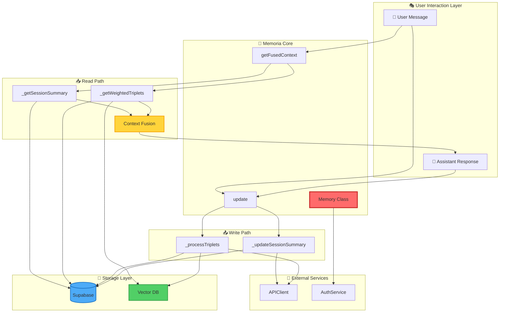
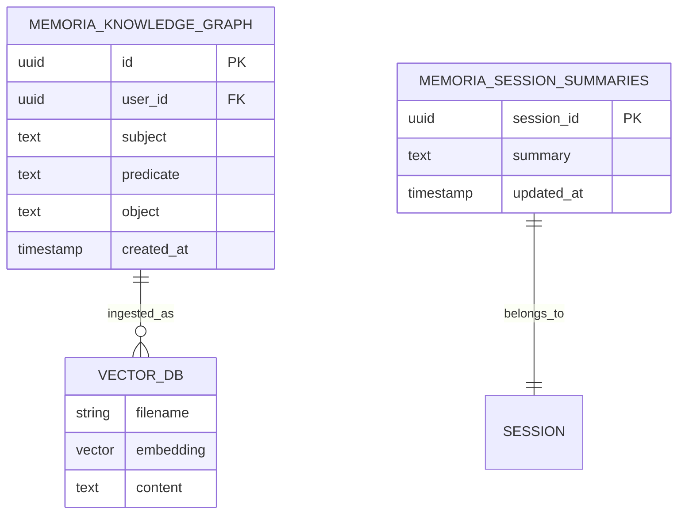
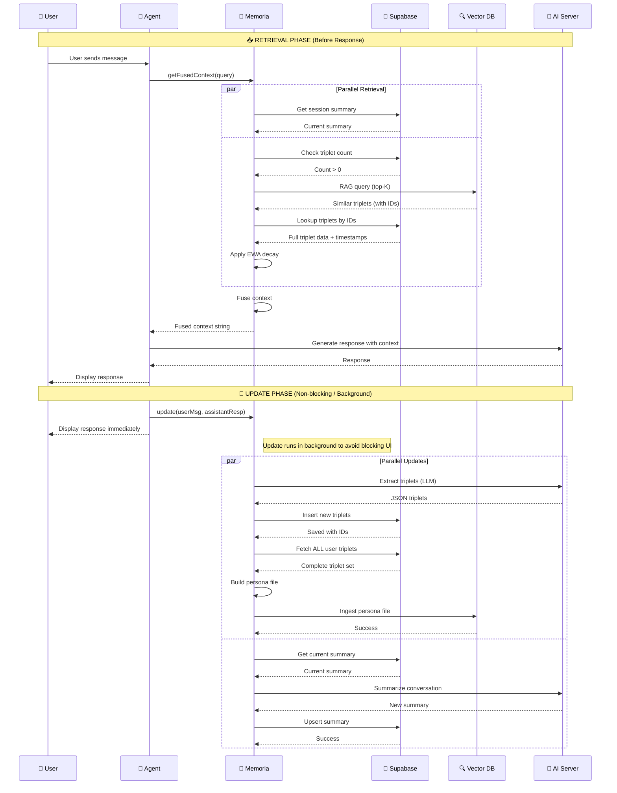
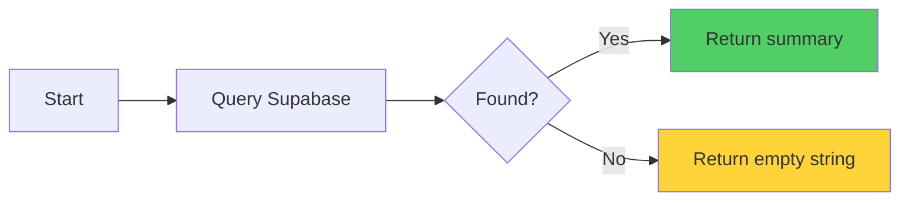
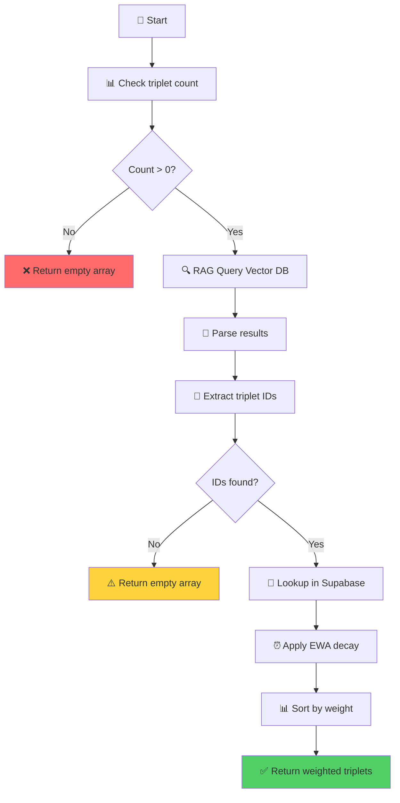
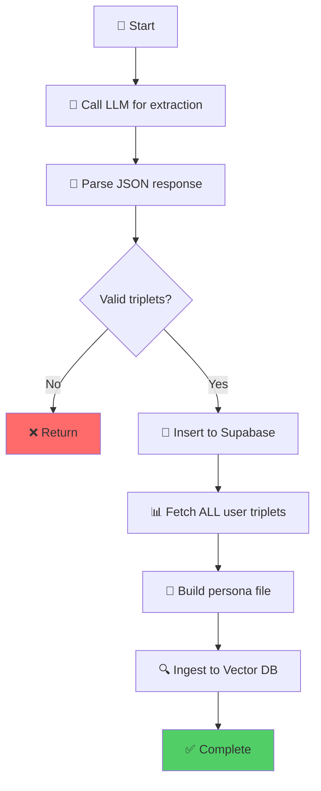
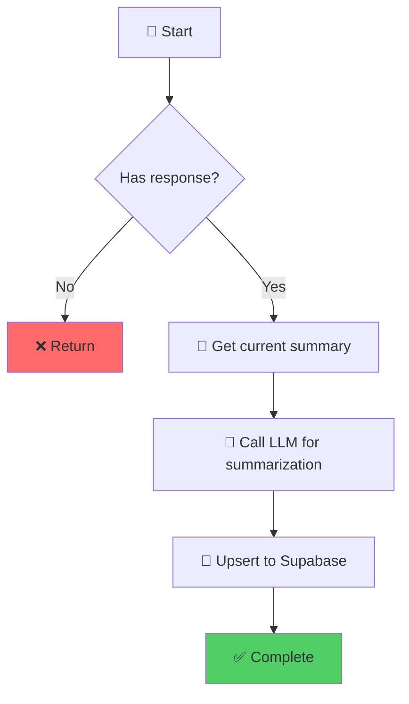
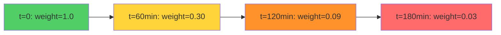

# 🧠 Memoria Framework - Complete Algorithm

> **Hybrid Memory System**: Combining Supabase relational storage with AI Server Vector DB for semantic persona search with temporal decay.

---

## 📋 Table of Contents

1. [🎯 Overview](#-overview)
2. [🏗️ Architecture](#️-architecture)
3. [🔄 Core Algorithm Flow](#-core-algorithm-flow)
4. [📥 Memory Retrieval (Read Path)](#-memory-retrieval-read-path)
5. [📤 Memory Update (Write Path)](#-memory-update-write-path)
6. [⚡ Optimization Strategies](#-optimization-strategies)
7. [🧮 Mathematical Models](#-mathematical-models)
8. [🔧 Implementation Details](#-implementation-details)

---

## 🎯 Overview

**Memoria** is a sophisticated memory system that enables AI agents to maintain long-term, personalized knowledge about users while providing context-aware responses. It combines:

- 🗄️ **Supabase**: Relational storage for triplets and session summaries
- 🔍 **Vector DB**: Semantic search via AI Server's RAG system
- ⏰ **Temporal Decay**: Exponentially Weighted Average (EWA) for recency bias
- 🧩 **Knowledge Graph**: Triplet-based (Subject-Predicate-Object) representation

### 🎨 Key Features

✅ **Hybrid Storage**: Best of both relational and vector databases  
✅ **Semantic Search**: RAG-powered retrieval of relevant memories  
✅ **Temporal Awareness**: Recent memories weighted higher  
✅ **Session Continuity**: Rolling summaries of ongoing conversations  
✅ **Scalable**: Efficient querying even with thousands of triplets  

---

## 🏗️ Architecture



### 🗂️ Database Schema



---

## 🔄 Core Algorithm Flow



---

## 📥 Memory Retrieval (Read Path)

### 1️⃣ **getFusedContext(query)** - Main Entry Point

**Purpose**: Retrieve relevant context for the current user query.

**Algorithm**:
```javascript
async getFusedContext(query) {
    // Parallel retrieval for speed
    const [summary, triplets] = await Promise.all([
        this._getSessionSummary(),      // Get conversation summary
        this._getWeightedTriplets(query) // Get relevant persona facts
    ]);
    
    // Fuse into single context string
    return getContextFusionInstructions(summary, triplets);
}
```

**Output Format**:
```
📝 SESSION CONTEXT:
[Rolling summary of current conversation]

🧩 PERSONA KNOWLEDGE:
- Subject: predicate object (weight: 0.95)
- Subject: predicate object (weight: 0.87)
...
```

---

### 2️⃣ **_getSessionSummary()** - Conversation Memory

**Purpose**: Retrieve the rolling summary of the current session.

**Algorithm**:


**SQL Query**:
```sql
SELECT summary 
FROM memoria_session_summaries 
WHERE session_id = ?
LIMIT 1
```

**Complexity**: `O(1)` - Direct lookup by primary key

---

### 3️⃣ **_getWeightedTriplets(query)** - Semantic Persona Search

**Purpose**: Find the most relevant persona facts using semantic search + temporal decay.

**Algorithm Flow**:



**Detailed Steps**:

#### **Step 1**: 📊 Optimization Check
```javascript
// Avoid expensive RAG call if user has no triplets
const { count } = await supabase
    .from('memoria_knowledge_graph')
    .select('*', { count: 'exact', head: true })
    .eq('user_id', this.userId);

if (count === 0) return [];
```

#### **Step 2**: 🔍 RAG Query
```javascript
const results = await APIClient.queryDocument(
    apiEndpoint,
    apiToken,
    query,                    // User's current message
    personaFilename,          // "persona_kg_{userId}.txt"
    embeddingModel,           // e.g., "text-embedding-3-small"
    5                         // Top-K results
);
```

**Vector DB Response Format**:
```json
[
  {
    "document": "a1b2c3d4-...: John likes pizza",
    "score": 0.92
  },
  {
    "document": "e5f6g7h8-...: John works at Google\nf9g0h1i2-...: John lives in NYC",
    "score": 0.87
  }
]
```

#### **Step 3**: 🔑 ID Extraction
```javascript
const idMap = new Map();
const ids = [];

results.forEach(res => {
    const content = res.document || res.content;
    const similarity = res.score ?? res.similarity;
    
    // Handle multi-line documents
    const lines = content.split('\n').filter(line => line.trim());
    
    lines.forEach(line => {
        // Extract UUID from format: "UUID: subject predicate object"
        const match = line.match(/([0-9a-f-]{36}):/);
        if (match) {
            const id = match[1];
            idMap.set(id, similarity || 1.0);
            ids.push(id);
        }
    });
});
```

#### **Step 4**: 💾 Supabase Lookup
```javascript
const { data: dbTriplets } = await supabase
    .from('memoria_knowledge_graph')
    .select('id, subject, predicate, object, created_at')
    .in('id', ids);
```

#### **Step 5**: ⏰ Temporal Decay (EWA)
```javascript
const now = new Date();
const weightedTriplets = dbTriplets.map(t => {
    const similarity = idMap.get(t.id) || 0.5;
    const createdAt = new Date(t.created_at);
    const deltaMin = (now - createdAt) / (1000 * 60); // Minutes elapsed
    
    // Exponentially Weighted Average
    const weight = similarity * Math.exp(-this.decayRate * deltaMin);
    
    return { ...t, weight };
});

return weightedTriplets.sort((a, b) => b.weight - a.weight);
```

**Complexity**: 
- RAG Query: `O(log N)` (vector similarity search)
- ID Extraction: `O(K)` where K = top-K results
- Supabase Lookup: `O(K)` (indexed lookup)
- **Total**: `O(log N + K)`

---

## 📤 Memory Update (Write Path)

### 4️⃣ **update(userMessage, assistantResponse)** - Main Entry Point

**Purpose**: Update memory after each interaction.

**Algorithm**:
```javascript
async update(userMessage, assistantResponse) {
    if (!userMessage) return;
    
    // Parallel updates for speed
    await Promise.all([
        this._processTriplets(userMessage),
        this._updateSessionSummary(userMessage, assistantResponse)
    ]);
}
```

---

### 5️⃣ **_processTriplets(userMessage)** - Knowledge Graph Update

**Purpose**: Extract new facts from user message and update the knowledge graph + vector DB.

**Algorithm Flow**:



**Detailed Steps**:

#### **Step 1**: 🎯 LLM Extraction
```javascript
const prompt = getTripletExtractionPrompt(userMessage);
const res = await APIClient.sendMessage(
    apiEndpoint,
    apiToken,
    modelText,
    [{ role: 'user', content: prompt }],
    { type: "json_object" }  // Force JSON output
);
```

**Prompt Template** (from `prompts/memory.js`):
```
Extract knowledge triplets from the following message.
Return ONLY a JSON array of triplets in format:
[
  {"subject": "...", "predicate": "...", "object": "..."},
  ...
]

Message: {userMessage}
```

**Example Output**:
```json
[
  {"subject": "John", "predicate": "likes", "object": "pizza"},
  {"subject": "John", "predicate": "works_at", "object": "Google"},
  {"subject": "John", "predicate": "prefers", "object": "dark mode"}
]
```

#### **Step 2**: 💾 Supabase Insert
```javascript
const insertTasks = triplets.map(t => {
    return supabase.from('memoria_knowledge_graph').insert({
        user_id: this.userId,
        subject: t.subject,
        predicate: t.predicate,
        object: t.object
    }).select('id, subject, predicate, object').maybeSingle();
});

const results = await Promise.all(insertTasks);
const savedTriplets = results.map(r => r.data).filter(Boolean);
```

#### **Step 3**: 📊 Rebuild Persona File
```javascript
// Fetch ALL triplets for this user
const { data: allTriplets } = await supabase
    .from('memoria_knowledge_graph')
    .select('id, subject, predicate, object')
    .eq('user_id', this.userId);

// Create virtual file: "UUID: subject predicate object"
const fileContent = allTriplets
    .map(t => `${t.id}: ${t.subject} ${t.predicate} ${t.object}`)
    .join('\n');
```

**Example Persona File**:
```
a1b2c3d4-e5f6-7890-abcd-ef1234567890: John likes pizza
b2c3d4e5-f6g7-8901-bcde-f12345678901: John works_at Google
c3d4e5f6-g7h8-9012-cdef-123456789012: John prefers dark_mode
d4e5f6g7-h8i9-0123-def1-234567890123: John lives_in New_York
```

#### **Step 4**: 🔍 Vector DB Ingestion
```javascript
const blob = new Blob([fileContent], { type: 'text/plain' });
const file = new File([blob], this.personaFilename, { type: 'text/plain' });

await APIClient.ingestDocument(
    apiEndpoint,
    apiToken,
    file,
    embeddingModel  // e.g., "text-embedding-3-small"
);
```

**Why Full Rebuild?**
- ✅ Ensures Vector DB is always in sync with Supabase
- ✅ Handles deletions/updates automatically
- ✅ Simpler than incremental updates
- ⚠️ Trade-off: Higher write cost for consistency

**Complexity**: 
- LLM Extraction: `O(1)` (fixed prompt size)
- Supabase Insert: `O(T)` where T = new triplets
- Fetch All: `O(N)` where N = total triplets
- Ingestion: `O(N)` (embedding generation)
- **Total**: `O(N + T)`

---

### 6️⃣ **_updateSessionSummary(userMessage, assistantResponse)** - Conversation Summary

**Purpose**: Maintain a rolling summary of the current session.

**Algorithm Flow**:



**Detailed Steps**:

#### **Step 1**: 📖 Get Current Summary
```javascript
const currentSummary = await this._getSessionSummary();
```

#### **Step 2**: 🎯 LLM Summarization
```javascript
const prompt = getSessionSummarizationPrompt(
    currentSummary,
    userMessage,
    assistantResponse
);

const res = await APIClient.sendMessage(
    apiEndpoint,
    apiToken,
    modelText,
    [{ role: 'user', content: prompt }]
);

const newSummary = res.content?.trim();
```

**Prompt Template** (from `prompts/memory.js`):
```
Update the session summary with the latest interaction.

Current Summary:
{currentSummary}

New Interaction:
User: {userMessage}
Assistant: {assistantResponse}

Provide an updated, concise summary that captures:
1. Main topics discussed
2. Key decisions or preferences
3. Ongoing context

Keep it under 200 words.
```

#### **Step 3**: 💾 Upsert Summary
```javascript
await supabase.from('memoria_session_summaries').upsert({
    session_id: this.sessionId,
    summary: newSummary,
    updated_at: new Date().toISOString()
});
```

**Complexity**: `O(1)` (fixed-size summary)

---

## ⚡ Optimization Strategies

### 🚀 Performance Optimizations

#### 1️⃣ **Non-Blocking Knowledge Ingestion**
The update phase (`memory.update()`) is explicitly non-awaited in the `GeneralPurposeAgent.js` and `ChatManager.js`. This prevents the "Memory Sink" (triplet extraction + VDB ingestion) from adding 5-10s of latency to the user's perceived response time.

#### 2️⃣ **On-Demand Trace Loading**
To keep session initialization fast, message traces (`agent_trace`) are excluded from the main `fetchMessages` SQL query. They are fetched asynchronously via `SessionStorage.fetchMessageTrace(id)` ONLY when the user interacts with the Trace UI.

#### 3️⃣ **Parallel-Check Retrieval**
```javascript
// Optimized: Run count check and RAG query in parallel
const [countRes, ragResults] = await Promise.all([
    supabase.from('memoria_knowledge_graph').select('*', { count: 'exact', head: true }).eq('user_id', this.userId),
    APIClient.queryDocument(...)
]);

const { count } = countRes;
const results = ragResults;
if (count === 0) return [];
```

**Benefit**: Saves ~250ms by eliminating the sequential dependency between the database check and the vector server.

---

#### 4️⃣ **Parallel Execution**
```javascript
// Retrieval: Parallel summary + triplets
const [summary, triplets] = await Promise.all([
    this._getSessionSummary(),
    this._getWeightedTriplets(query)
]);

// Update: Parallel triplet processing + summarization
await Promise.all([
    this._processTriplets(userMessage),
    this._updateSessionSummary(userMessage, assistantResponse)
]);
```

**Benefit**: 2x speedup on I/O-bound operations

---

#### 5️⃣ **Lazy User ID Resolution**
```javascript
get userId() {
    // Late-binding: Only fetch from AuthService if needed
    if (this._userId === "00000000-0000-0000-0000-000000000000") {
        const currentId = AuthService.getUserId();
        if (currentId) {
            this.userId = currentId;
        }
    }
    return this._userId;
}
```

**Benefit**: Handles initialization race conditions gracefully

---

#### 6️⃣ **Batch Inserts**
```javascript
const insertTasks = triplets.map(t => 
    supabase.from('memoria_knowledge_graph').insert({...})
);
await Promise.all(insertTasks);
```

**Benefit**: Parallel inserts vs. sequential (N×speedup)

---

### 🛡️ Error Handling Strategies

#### 1️⃣ **Graceful Degradation**
```javascript
try {
    const triplets = await this._getWeightedTriplets(query);
    return triplets;
} catch (e) {
    console.error("Error retrieving triplets:", e);
    return []; // Return empty instead of crashing
}
```

---

#### 2️⃣ **Robust JSON Parsing**
```javascript
// Handle both raw arrays and wrapped objects
let triplets = [];
const parsed = JSON.parse(content);

if (Array.isArray(parsed)) {
    triplets = parsed;
} else if (parsed.triplets && Array.isArray(parsed.triplets)) {
    triplets = parsed.triplets;
}
```

---

#### 3️⃣ **Format Flexibility**
```javascript
// Handle both API response formats
const content = res.document || res.content;
const similarity = res.score !== undefined ? res.score : res.similarity;
```

---

## 🧮 Mathematical Models

### ⏰ Exponentially Weighted Average (EWA)

**Purpose**: Give higher weight to recent memories while preserving older ones.

**Formula**:
```
weight = similarity × e^(-λ × Δt)

where:
  similarity = Vector similarity score (0-1)
  λ = Decay rate (default: 0.02)
  Δt = Time elapsed in minutes
  e = Euler's number (≈2.718)
```

**Implementation**:
```javascript
const deltaMin = (now - createdAt) / (1000 * 60);
const weight = similarity * Math.exp(-this.decayRate * deltaMin);
```

**Decay Visualization**:



**Decay Rate Impact**:

| λ (Decay Rate) | Half-life | Use Case |
|----------------|-----------|----------|
| 0.01 | ~69 min | Long-term memory |
| 0.02 | ~35 min | **Default** (balanced) |
| 0.05 | ~14 min | Short-term focus |
| 0.10 | ~7 min | Immediate context only |

**Example Calculation**:
```
Triplet: "John likes pizza"
Similarity: 0.92
Created: 45 minutes ago
Decay Rate: 0.02

weight = 0.92 × e^(-0.02 × 45)
       = 0.92 × e^(-0.9)
       = 0.92 × 0.4066
       = 0.374

Result: Still relevant but weighted down from original 0.92
```

---

## 🔧 Implementation Details

### 📦 Dependencies

```javascript
import { supabase } from '../supabaseClient.js';
import { APIClient } from './APIClient.js';
import { AuthService } from './AuthService.js';
import {
    getTripletExtractionPrompt,
    getSessionSummarizationPrompt,
    getContextFusionInstructions
} from '../prompts/memory.js';
```

---

### 🎛️ Configuration

```javascript
class Memory {
    constructor(sessionId, userId, settings = null) {
        this.sessionId = sessionId;
        this._userId = userId || "00000000-0000-0000-0000-000000000000";
        this._settings = settings;
        this.decayRate = 0.02; // Lambda for EWA
        this.updatePersonaFilename();
    }
}
```

**Key Properties**:
- `sessionId`: Unique identifier for current conversation
- `userId`: User identifier (lazy-loaded from AuthService)
- `settings`: API configuration (endpoint, token, models)
- `decayRate`: Temporal decay parameter (λ)
- `personaFilename`: `persona_kg_{userId}.txt`

---

### 🔐 Security Considerations

#### 1️⃣ **User Isolation**
```javascript
// All queries scoped to user_id
.eq('user_id', this.userId)
```

#### 2️⃣ **API Token Protection**
```javascript
// Never log tokens
console.log('[DEBUG] Endpoint:', this.settings.apiEndpoint);
// ❌ DON'T: console.log('[DEBUG] Token:', this.settings.apiToken);
```

#### 3️⃣ **Input Validation**
```javascript
if (!userMessage) return; // Prevent empty updates
if (!s || !p || !o) return null; // Validate triplet structure
```

---

### 🐛 Debugging Features

The implementation includes comprehensive logging:

```javascript
console.log('[MEMORIA DEBUG] Starting _getWeightedTriplets with query:', query);
console.log('[MEMORIA DEBUG] User ID:', this.userId);
console.log('[MEMORIA DEBUG] Persona filename:', this.personaFilename);
console.log('[MEMORIA DEBUG] Supabase triplet count:', count);
console.log('[MEMORIA DEBUG] RAG results:', results);
console.log('[MEMORIA DEBUG] Extracted IDs:', ids);
console.log('[MEMORIA DEBUG] Returning weighted triplets:', weightedTriplets);
```

**Debug Checklist**:
- ✅ Query parameters logged
- ✅ Intermediate results captured
- ✅ Error conditions reported
- ✅ Performance metrics tracked

---

## 🎯 Complete Flow Example

### Scenario: User says "I love hiking in the mountains"

#### **Phase 1: Retrieval** (Before Response)

1️⃣ **Query**: "I love hiking in the mountains"

2️⃣ **Session Summary Retrieved**:
```
User has been discussing outdoor activities and weekend plans.
```

3️⃣ **RAG Query** → Vector DB returns:
```json
[
  {"document": "abc-123: John enjoys outdoor_activities", "score": 0.89},
  {"document": "def-456: John visited Colorado_mountains", "score": 0.82}
]
```

4️⃣ **Supabase Lookup** → Full triplets:
```json
[
  {"id": "abc-123", "subject": "John", "predicate": "enjoys", "object": "outdoor_activities", "created_at": "2026-02-07T10:00:00Z"},
  {"id": "def-456", "subject": "John", "predicate": "visited", "object": "Colorado_mountains", "created_at": "2026-02-06T15:00:00Z"}
]
```

5️⃣ **EWA Applied** (assuming 30 hours elapsed for second triplet):
```
Triplet 1: weight = 0.89 × e^(-0.02 × 60) = 0.89 × 0.30 = 0.27
Triplet 2: weight = 0.82 × e^(-0.02 × 1800) = 0.82 × 0.00 ≈ 0.00
```

6️⃣ **Fused Context**:
```
📝 SESSION CONTEXT:
User has been discussing outdoor activities and weekend plans.

🧩 PERSONA KNOWLEDGE:
- John enjoys outdoor_activities (weight: 0.27)
```

7️⃣ **Agent Response**: "That's great! I remember you enjoy outdoor activities. The mountains must be perfect for you!"

---

#### **Phase 2: Update** (After Response)

1️⃣ **Triplet Extraction** → LLM returns:
```json
[
  {"subject": "John", "predicate": "loves", "object": "hiking"},
  {"subject": "John", "predicate": "prefers", "object": "mountain_hiking"}
]
```

2️⃣ **Supabase Insert** → New triplets saved with IDs:
```
ghi-789: John loves hiking
jkl-012: John prefers mountain_hiking
```

3️⃣ **Rebuild Persona File**:
```
abc-123: John enjoys outdoor_activities
def-456: John visited Colorado_mountains
ghi-789: John loves hiking
jkl-012: John prefers mountain_hiking
```

4️⃣ **Vector DB Ingestion** → File embedded and indexed

5️⃣ **Session Summary Update**:
```
User has been discussing outdoor activities and weekend plans.
User expressed love for hiking in mountains, particularly mountain hiking.
```

---

## 🎓 Summary

### ✨ Key Takeaways

1. **🔄 Hybrid Architecture**: Combines relational (Supabase) + vector (RAG) for best of both worlds
2. **⏰ Temporal Awareness**: EWA ensures recent memories are prioritized
3. **🚀 Performance**: Parallel execution + early exits for speed
4. **🛡️ Robustness**: Graceful degradation and comprehensive error handling
5. **📊 Scalability**: Efficient even with thousands of triplets

### 🔮 Future Enhancements

- 🔄 **Incremental Vector Updates**: Avoid full rebuild on every update
- 🗑️ **Memory Pruning**: Auto-delete low-weight triplets after N days
- 🔗 **Cross-Session Linking**: Connect related sessions for deeper context
- 📈 **Analytics Dashboard**: Visualize memory growth and usage patterns
- 🧪 **A/B Testing**: Experiment with different decay rates per user

---

**🎉 End of Memoria Algorithm Documentation**
