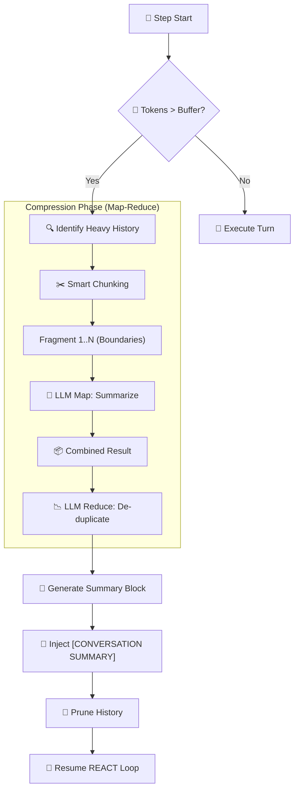

# 📝 Memory & Context Management

This document explores how the system maintains "Infinite Presence" within the finite constraints of LLM context windows.

---

## 🔗 The Scratchpad (Pass-by-Reference)
The **Scratchpad** is the central nervous system for data handling. It allows the agent to manipulate massive payloads without "choking" the prompt.

### ❓ The Problem
Standard LLMs fail on massive data due to:
*   💸 **Cost**: High token consumption.
*   🧠 **Attention**: "Lost in the middle" phenomenon.
*   💥 **Structural Failure**: Giant strings breaking JSON tool definitions.

### 🔄 The "Reference-Life" Cycle
1.  **📥 Write**: The Input Gatekeeper saves giant files ⮕ 📝 **Scratchpad**.
2.  **🔗 Link**: A lightweight `ref:key` is passed to the LLM.
3.  **🔎 Discovery**: The Agent uses `scratchpad_list` to see what is stored.
4.  **✂️ Granular Access**: Agent reads exactly what it needs via `scratchpad_read_chunk`.
5.  **⚙️ Execution**: References are resolved *only* at the point of tool execution.

---

## 🖇️ Context Optimization & Compression
When the conversation gets "heavy," the **Context Compressor** utility (`ContextCompressor` in `cli/cowork/agent.py`) activates automatically.

### Compression Safety Contract (Current)
1. **No compression without reference**:
   - Before conversation compression, full source history is archived to scratchpad with a named `ref:key`.
   - The injected summary includes that source pointer.
2. **No summary-of-summary loops**:
   - Prior `[CONVERSATION SUMMARY]` system messages are excluded from future compression input.
3. **No scratchpad-of-scratchpad loops**:
   - Outputs already marked with `[Full result saved as ref:...]` are not compressed again.

### 1️⃣ Atomic Compression (Surge Protection)
Identifies **"Heavy Nodes"**—single messages (e.g., a huge SQL output) occupying >75% of the window.
*   🎯 **Action**: Fragments the message for targeted reduction.
*   🌡️ **Precision**: Runs at **Temp 0.1** to protect facts and numbers.

### 2️⃣ History Rolling Window (Deep Cleanup)
Synthesizes older parts of the conversation into a coherent narrative block.
*   🛡️ **Identity Protection**: The System Identity and the **Last 2 Human Messages** are never compressed.

---

## 📉 Compression Logic (Map-Reduce)
We use a recursive pipeline to ensure that reduction doesn't equal loss of intelligence.

### ✂️ Smart Chunking
The `_smart_chunk` utility identifies **semantic boundaries** (newlines, sentence ends) rather than cutting mid-word, ensuring context flows correctly through the Map phase.

---

## 🥪 The Sandwich Preview
For instant feedback without LLM overhead, the system uses a **Sandwich Reduction**:
- 🟢 **Head**: The introduction/header.
- 🟡 **Middle**: A core representative snippet.
- 🔴 **Tail**: The conclusion/bottom data.

> **Note**: This is the default format for the **Input Gatekeeper** preview.
