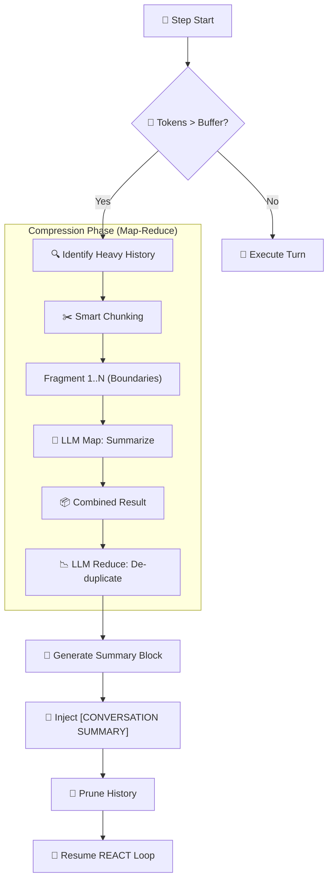

# 📝 Memory & Context Management

This document explores how the system maintains "Infinite Presence" within the finite constraints of LLM context windows.

---

## 🔗 The Scratchpad (Pass-by-Reference)
The **Scratchpad** is the central nervous system for data handling. It allows the agent to manipulate massive payloads without "choking" the prompt by passing lightweight `ref:key` pointers.

### 🏷️ Naming Conventions
The system enforces specific naming patterns to help the agent (and users) identify data at a glance:
*   `run_step_ledger`: A **rolling turn history** of tool-step assessments (tool results, status, and findings) for the current run.
*   `session_tool_ledger`: (Cross-turn awareness) A **compact cumulative list** of all tool calls executed across every turn of the session. Stored as name+status only (no args) to stay small. Injected into the system prompt (≤600 chars) so the LLM knows what has already been done and doesn't repeat it.
*   `_index.json`: The internal **metadata index** tracking keys, sizes, and timestamps of all scratchpad entries.
*   `task_goal`: (Critical) The **Task Anchor**. Stores the structured goal, scope, and current state. 
*   `mem_...`: Meaningful snapshots of important conversation turns (personality/preferences).
*   `last_assistant_response`: Exactly what was just said (for tool chaining like TTS or file generation).
*   `assistant_step_...`: Snapshots of internal reasoning steps during the REACT loop.
*   `input_...`: Large user payloads offloaded by the Gatekeeper.
*   `conversation_...`: Full history archived before Map-Reduce compression.
*   `tool_output_...`: Large outputs from tools (e.g., a long file list or a complex JSON).

### 🔄 Scratchpad Lifecycle Table

| File Key / Pattern | Created | Updated | Primary Use | Retention / Deletion |
| :--- | :--- | :--- | :--- | :--- |
| `_index.json` | First scratchpad write | Every scratchpad save | Discovery & prompt indexing | Persistent per session |
| `task_goal` | Start of multi-step task | After each refinement turn | Turn re-orientation (reads first) | Persistent / Manual update |
| `run_step_ledger` | After first tool execution | After every tool execution | Continuity & Step-by-step debug | Rolling (last 12 steps) |
| `session_tool_ledger` | After first tool turn | Appended every tool turn | Cross-turn anti-hallucination (≤60 entries, name+status only) | Rolling (last 60 calls) |
| `last_assistant_response`| Every turn completion | N/A (Overwritten) | Tool chaining (e.g. TTS) | Overwritten every turn |
| `assistant_step_...` | During REACT loop (>400 chars) | N/A (Unique per step) | Reasoning continuity | Persistent per session |
| `mem_...` | Durable user turn detected | N/A (Unique per turn) | Personality & Preferences | Persistent / Long-term |
| `input_...` | Phase 1 (Gatekeeper) | N/A | Agent ingestion (Phases 2-3) | Persistent per session |
| `conversation_...` | Phase 4 (Compression) | N/A | Context window overflow recovery | Persistent per session |
| `tool_output_...` | Tool results > token limit | N/A | Granular data synthesis | Persistent per session |

### 🔄 The "Reference-Life" Cycle
1.  **📥 Write**: The Input Gatekeeper or Tool Executor saves giant blobs ⮕ 📝 **Scratchpad**.
2.  **🔗 Link**: A lightweight `ref:key` is passed to the LLM.
3.  **🔎 Discovery**: The Agent uses `scratchpad_list` or the injected **Scratchpad Index** in the system prompt to see what is stored.
4.  **✂️ Granular Access**: Agent reads exactly what it needs via `scratchpad_read_chunk` (e.g., reading `ref:task_goal` at the start of every turn).
5.  **⚙️ Execution**: References are resolved *only* at the point of tool execution.

### 🧠 LLM Retrieval Strategy
The LLM doesn't just "guess" when to read a scratchpad entry. It follows an explicit protocol:
- **Mandatory Anchoring**: If `ref:task_goal` exists, it is the FIRST tool call of every turn.
- **Reference Awareness**: Any tool output exceeding token limits is replaced with `[Full result saved as ref:...]`. The LLM is trained to follow these pointers when detail is required.
- **Live Index**: The system prompt contains a live list of keys, descriptions, and sizes, giving the LLM immediate awareness of its "extended memory."

---

## 🖇️ Context Optimization & Compression
When the conversation gets "heavy," the **Context Compressor** utility (`ContextCompressor` in `cli/cowork/agent.py`) activates automatically.

### Compression Safety Contract (Current)
1. **No compression without reference**:
   - Before conversation compression, full source history is archived to scratchpad with a named `ref:key`.
   - The injected summary includes that source pointer.
2. **No summary-of-summary loops**:
   - Prior `[CONVERSATION SUMMARY]` system messages are excluded from future compression input.
3. **No scratchpad-of-scratchpad loops**:
   - Outputs already marked with `[Full result saved as ref:...]` are not compressed again.

### 1️⃣ Atomic Compression (Surge Protection)
Identifies **"Heavy Nodes"**—single messages (e.g., a huge SQL output) occupying >75% of the window.
*   🎯 **Action**: Fragments the message for targeted reduction.
*   🌡️ **Precision**: Runs at **Temp 0.1** to protect facts and numbers.

### 2️⃣ History Rolling Window (Deep Cleanup)
Synthesizes older parts of the conversation into a coherent narrative block.
*   🛡️ **Identity Protection**: The System Identity and the **Last 2 Human Messages** are never compressed.

---

## 📉 Compression Logic (Map-Reduce)
We use a recursive pipeline to ensure that reduction doesn't equal loss of intelligence.

```mermaid
graph TD
    A[🏁 Step Start] --> B{🚦 Tokens > Buffer?}
    B -- No --> C[🏃 Execute Turn]
    B -- Yes --> D[🔍 Identify Heavy History]
    
    subgraph "Compression Phase (Map-Reduce)"
        D --> E[✂️ Smart Chunking]
        E --> F["Fragment 1..N (Boundaries)"]
        F --> G[🧠 LLM Map: Summarize]
        G --> H[📦 Combined Result]
        H --> I["📉 LLM Reduce: De-duplicate"]
    end
    
    I --> J[📝 Generate Summary Block]
    J --> K["💉 Inject [CONVERSATION SUMMARY]"]
    K --> L[🧹 Prune History]
    L --> M[🔄 Resume REACT Loop]
```

### ✂️ Smart Chunking
The `_smart_chunk` utility identifies **semantic boundaries** (newlines, sentence ends) rather than cutting mid-word, ensuring context flows correctly through the Map phase.

---

## 🥪 The Sandwich Preview
For instant feedback without LLM overhead, the system uses a **Sandwich Reduction**:
- 🟢 **Head**: The introduction/header.
- 🟡 **Middle**: A core representative snippet.
- 🔴 **Tail**: The conclusion/bottom data.

> **Note**: This is the default format for the **Input Gatekeeper** preview.
