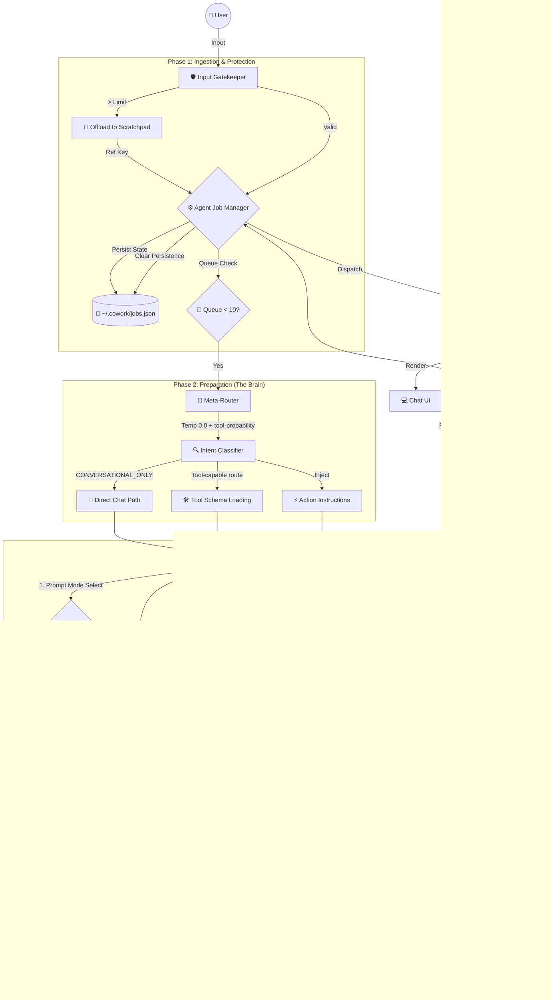

# 🌐 Agentic System Overview

## 🚀 Introduction
The **Makix Enterprise Agentic System** is a high-performance, resilient AI orchestration layer. It is engineered to overcome LLM context window limits and statelessness through two core innovations:

1.  🎭 **"Manager-Worker" Persona**: Enforces coordination over verbosity.
2.  🔗 **"Pass-by-Reference" Memory**: Handles massive data via pointer-based logic.

---

## 🏛️ Global Architecture
The system is partitioned into three functional "Cerebral Zones":

### 🛡️ Zone 1: Ingestion & Protection
*Gatekeeping the context window.*

### 🧠 Zone 2: Preparation (The Brain)
*Intent analysis and tool selection.*

### 🛠️ Zone 3: Execution (The Worker)
*Recursive reasoning and tool execution.*

### ✅ Current CLI Runtime Notes (2026)
- Routes every turn through the Meta-Router before selecting tool schemas.
- Uses a **split system prompt strategy**:
  - `AGENT_CHAT_SYSTEM_PROMPT` for simple chat turns.
  - `AGENT_SYSTEM_PROMPT` for multi-step/tool-oriented turns.
- Limits `✅/⚠️/❌ GOAL ...` status banners to **step-limit self-assessment** only.
- Applies **selective memory persistence** (durable user profile/preferences/project state).
- Applies **semantic + topical relevance gates** for memory retrieval.

---

## 📚 Documentation Index
| Module | Focus | Link |
| :--- | :--- | :--- |
| 🔄 **Workflow** | Phase-by-phase request lifecycle | [View Workflow](./Workflow.md) |
| 📝 **Memory** | Scratchpad & Compression logic | [View Memory](./Memory.md) |
| 🧠 **Intelligence** | Routing & Temperature tiers | [View Intelligence](./Intelligence.md) |
| 🛡️ **Operations** | Queue, Persistence & Safety | [View Operations](./Operations.md) |

---

## 💎 Core Philosophical Pillars
- 💰 **Context is Currency**: Don't spend tokens on raw data unless required for reasoning.
- 🎯 **Precision over Creativity**: Logic tiers (routing, compression) run at near-zero temperature.
- ⚡ **Lean Orchestration**: Routing and schema loading stay minimal and task-scoped.
- 💾 **Persistence & Caching**: Every job is synced to survive crashes, and user context is cached to eliminate redundant Auth round-trips.
- 🧠 **Memory Discipline**: Only durable memories are persisted; only relevant memories are injected.
- 🔊 **Fail Loudly & Recursively**: Errors are fed back as observations for AI self-healing.
