# 🌐 Agentic System Overview

## 🚀 Introduction
The **Makix Enterprise Agentic System** is a high-performance, resilient AI orchestration layer. It is engineered to overcome LLM context window limits and statelessness through two core innovations:

1.  🎭 **"Manager-Worker" Persona**: Enforces coordination over verbosity.
2.  🔗 **"Pass-by-Reference" Memory**: Handles massive data via pointer-based logic.

---

## 🏛️ Global Architecture
The system is partitioned into three functional "Cerebral Zones":

### 🛡️ Zone 1: Ingestion & Protection
*Gatekeeping the context window.*

### 🧠 Zone 2: Preparation (The Brain)
*Intent analysis and tool selection.*

### 🛠️ Zone 3: Execution (The Worker)
*Recursive reasoning and tool execution.*

```mermaid
graph TD
    User((👤 User)) -->|Input| Gatekeeper[🛡️ Input Gatekeeper]

    subgraph "Phase 1: Ingestion & Protection"
        Gatekeeper -- "> Limit" --> Offload[📝 Offload to Scratchpad]
        Offload -->|Ref Key| JobMgr
        Gatekeeper -- "Valid" --> JobMgr{⚙️ Agent Job Manager}
        
        JobMgr -->|Persist State| Storage[(💾 localStorage)]
        JobMgr -->|Queue Check| Queue{🚦 Queue < 10?}
    end

    subgraph "Phase 2: Preparation (The Brain)"
        Queue -- Yes --> Router[🧭 Meta-Router]
        Router -->|Temp 0.0| Classifier[🔍 Intent Classifier]
        Classifier -->|Select| Tools[🛠️ Tool Schema Loading]
        Classifier -->|Inject| Actions[⚡ Action Instructions]
    end

    subgraph "Phase 3: Execution Loop (The Worker)"
        Tools --> Agent[🤖 General Purpose Agent]
        Actions --> Agent
        
        Agent -->|1. Check Context| Compressor[🖇️ Context Compressor]
        Compressor -- "Atomic Map-Reduce" --> LLM_S[📉 LLM Temp 0.1]
        LLM_S -->|Summary| Agent
        
        Agent -->|2. Generate| LLM_G[🧠 LLM Temp 0.4]
        LLM_G -->|Tool Calls| Gateway{🚧 Execution Gateway}
        
        Gateway -->|Resolve Refs| SP[(📝 Scratchpad)]
        Gateway -->|Execute| Executor[⚙️ Tool Executor]
        
        Executor -- "Result > Limit" --> Sandwich[🥪 Sandwich Preview]
        Sandwich --> Agent
        Executor -- "Result < Limit" --> Agent
    end

    Agent -->|Final Result| JobMgr
    JobMgr -->|Clear Persistence| Storage
    JobMgr -->|Dispatch| Notification[🔔 Notification System]
    Notification -->|Render| UI[💻 Chat UI]
```

---

## 📚 Documentation Index
| Module | Focus | Link |
| :--- | :--- | :--- |
| 🔄 **Workflow** | Phase-by-phase request lifecycle | [View Workflow](./Workflow.md) |
| 📝 **Memory** | Scratchpad & Compression logic | [View Memory](./Memory.md) |
| 🧠 **Intelligence** | Routing & Temperature tiers | [View Intelligence](./Intelligence.md) |
| 🛡️ **Operations** | Queue, Persistence & Safety | [View Operations](./Operations.md) |

---

## 💎 Core Philosophical Pillars
- 💰 **Context is Currency**: Don't spend tokens on raw data unless required for reasoning.
- 🎯 **Precision over Creativity**: Logic tiers (routing, compression) run at near-zero temperature.
- ⚡ **Parallel-First Orchestration**: Intent classification, memory retrieval, and tool discovery run concurrently to minimize "time-to-first-token."
- 💾 **Persistence & Caching**: Every job is synced to survive crashes, and user context is cached to eliminate redundant Auth round-trips.
- 🔊 **Fail Loudly & Recursively**: Errors are fed back as observations for AI self-healing.
