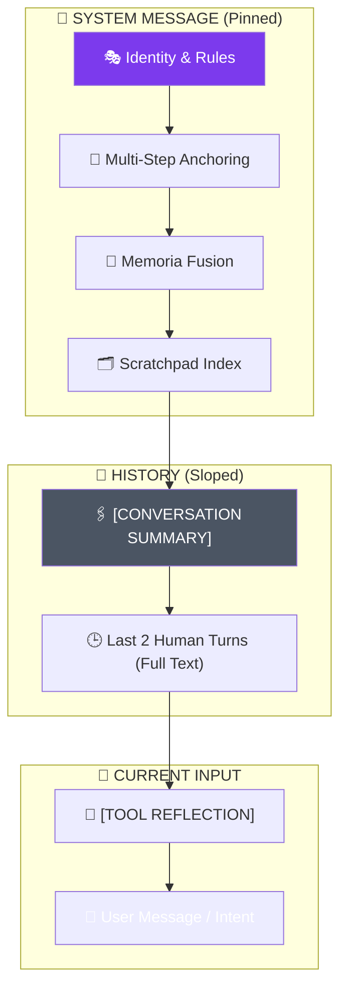

# 🏗️ Cowork Context Anatomy

This document provides a visual and technical breakdown of how a **Cowork LLM Message** is composed. To maintain "Infinite Presence" within a finite context window, the system uses a tiered "fused" architecture.

---

## 🛰️ The anatomy of a fused Request

In the worst-case scenario (a complex multi-step task with large data), a single LLM request looks like a layered stack.

### 🧬 Layer 1: the Permanent Identity (System)
*   **Persona & Principles**: Core instructions that never change.
*   **Step Budget Awareness**: Rules describing what the agent must do if it hits the reasoning limit.
*   **Task Anchoring Protocol**: Explicit instructions on how to use `ref:task_goal`.
*   **Temporal Context**: Current local time and date.

### 🧠 Layer 2: the Long-term Memory (Memoria)
*   **Session Narrative**: A high-level summary of previous sessions retrieved from memory.
*   **Persona Knowledge**: Top-K semantic triplets (e.g., `(User, prefers, Rust)`) retrieved via local vector search.

### 🗂️ Layer 3: the Session Scratchpad Index
*   **Live Metadata**: A compact list of every `ref:key` currently stored for the session.
*   **Task Goal**: A "Task Anchor" pointing to the current goal, scope, and next steps.

### 🖇️ Layer 4: the history (Compressed)
*   **[CONVERSATION SUMMARY]**: If the history exceeds the buffer, the middle is collapsed into a dense narrative block.
*   **Sliding Window**: The most recent 2-3 human-meaningful turns are kept in full text.

### 🎯 Layer 5: the Current Input & Tool Reflection
*   **[TOOL REFLECTION]**: For reasoning steps involving tools, the system distills raw tool text into a compact "Assessment" (Status, Finding, Next Action). This prevents the LLM from getting "distracted" by large logs and keeps it focused on verified evidence.
*   **Active Intent**: The user's latest message or the current follow-up goal.

---

## 📊 Technical Limits & Overflow Actions

| Component | Config Key | Default Limit | Overflow Strategy |
| :--- | :--- | :--- | :--- |
| **Active Context** | `context_limit_tokens` | **6,000 Tokens** | Map-Reduce Compression (Phase 4) |
| **Logic Step Limit** | `max_steps` | **10 Steps** | Emit Goal Status & Terminate Loop |
| **User Message** | `user_input_limit_tokens` | **2,000 Tokens** | Offload to `ref:input_*` (Phase 1) |
| **Tool Execution** | `tool_output_limit_tokens` | **2,000 Tokens** | Offload to `ref:tool_output_*` (Phase 3) |
| **Knowledge Graph** | `memory_kg_limit_triplets` | **100 Triplets** | Trigger LLM Consolidation & Merge |
| **Parallel Tools** | `max_tool_calls_per_step`| **3 Calls** | Parallelization Cap (Array Pruning) |

---

## 🔄 Visual Schema (Imbrication)

## 🛡️ PASS-BY-REFERENCE (Scratchpad)
Whenever a layer (User, Tool, or History) exceeds its token budget, the system **"Passes by Reference"**. Instead of the full text, the LLM sees:

> `[Large data offloaded to scratchpad. Reference: ref:key_name. Preview: ...]`

The LLM is then trained to call `scratchpad_read_chunk` ONLY when it needs the raw details, keeping the core reasoning path clean.
