# 🛠️ Tools & Capabilities Strategy

This document outlines the architectural strategy for **Tool Management** within the MakiX Enterprise Agent system. It details how tools are discovered, validated, executed, and how their results are managed within the constraints of LLM context windows.

## 1. 🔍 Overview
Tools are the "hands" of the agent, allowing it to interact with external systems, perform calculations, and fetch real-time data. The system is designed to be **dynamic**, **safe**, and **scalable**, supporting both hardcoded system tools and user-configured connectors.

> Current code references: `cli/cowork/tools/manager.py`, `cli/cowork/tools/registry.py`, `cli/cowork/router.py`.

---

## 2. 🧩 Tool Discovery & Sources
The agent does not simply receive a static list of tools. Instead, the available toolset is constructed dynamically at runtime based on user configuration and context.

### Sources
1.  **📦 Base Tools (`BaseTools.js`)**:
    *   Core utilities available to all agents (e.g., `calc`, `get_time`).
    *   Essential search functions (e.g., `web_search`, `search_docs`).
2.  **🔌 Connectors (`ConnectorService.js`)**:
    *   Dynamic integrations toggled by the user in the database (`chatbot_app.data_connectors`).
    *   Examples: `file_manager`, `google_drive`, `notion`.
    *   *Strategy*: These are loaded asynchronously only if `isEnabled` is true for the current user.
3.  **⚡ User Actions (`ActionService.js`)**:
    *   Custom scripts or workflows defined by users (Future Extensibility).

### Coding Group (Current)
The platform now uses `CODING_TOOLS` as the unified category for both code research (e.g., GitHub) and project implementation tasks (web, Python, backend/frontend work) within the local project root.

Tools:
- `codebase_list_files`
- `codebase_read_file`
- `codebase_search_text`
- `codebase_grep`
- `codebase_write_file`

---

## 3. 🚦 Schema Construction & Filtering
To prevent overwhelming the LLM with hundreds of tool definitions (which degrades reasoning performance and consumes tokens), we employ an **Intelligence Routing** strategy via the `MetaRouter`.

### 3.1 Categorization
Tools are grouped into high-level functional categories in `cli/cowork/router.py`:
*   `🔍 SEARCH_AND_INFO`: Retrieval tasks.
*   `🎥 MEDIA_AND_ENTERTAINMENT`: Image generation, YouTube.
*   `📊 DATA_AND_UTILITY`: Charts, calculation.
*   `🔗 APP_CONNECTORS`: Third-party integrations.
*   `💭 CONVERSATIONAL_ONLY`: Direct-answer mode with no tool schema.

### 3.2 The Routing Phase
Before the main execution loop, the `MetaRouter` performs an **Intent Classification** step using a small, fast model (or the main model).
1.  **Input**: User Prompt.
2.  **Output**: List of relevant categories (or `CONVERSATIONAL_ONLY`).
3.  **Result**: `get_available_tools_for_categories()` filters the master list and returns only relevant tools.

---

## 4. 🚀 Execution Pipeline
The path from an LLM deciding to use a tool to the actual execution is strictly guarded.

```mermaid
flowchart LR
    LLM[🤖 LLM Response] -->|JSON Tool Call| GP[GeneralPurposeAgent]
    GP -->|Raw Args| EG[🔒 ExecutionGateway]
    EG -->|Validation| EG
    EG -->|Ref Resolution| EG
    EG -->|Resolved Args| TE[⚙️ ToolExecutor]
    TE -->|Result| CM[🧠 Context Manager]
```

### 4.1 Usage Detection
The `APIClient` parses the `tool_calls` array from the LLM response. The system supports parallel tool execution (multiple tools in one turn).

### 4.2 The Execution Gateway (`ExecutionGateway` in `cli/cowork/tools/manager.py`)
This is the firewall between the LLM and the code.
1.  **🛡️ Schema Validation**: Verifies that required arguments exist and types match (String vs Number).
    *   *Failure*: Throws immediate error back to agent loop.
2.  **🔗 Reference Resolution**:
    *   *Problem*: LLMs cannot handle massive datasets in arguments.
    *   *Solution*: The 'Pointer System'.
    *   *Logic*: If an argument is `"ref:input_123"`, the Gateway fetches the actual content from `Scratchpad` and injects it into the tool execution.

### 4.3 The Tool Executor (`ToolExecutor` in `cli/cowork/tools/manager.py`)
Handles the actual logic.
*   **Standard Tools**: Executed directly via internal methods.
*   **Connectors**: Dispatched to `ConnectorService.executeTool()`.
*   **Status Updates**: Emits real-time UI statuses (e.g., "Scanning database...", "Rendering chart...").

---

## 5. 📦 Result Management & Compression
Handling large tool outputs (e.g., a 10,000-word scraped article) is critical to preventing context overflow.

### 5.1 The Safety Clamp
*   **Config**: `opToolOutputLimitTokens` (Default: ~1500 tokens).
*   **Strategy**: "Sandwich Compression".

### 5.2 Offloading Logic
If a tool result exceeds the token limit:
1.  **Intercept**: The `ToolExecutor` catches the large string.
2.  **Offload**: Saves the full content to `Scratchpad` (e.g., key `tool_output_search_999`).
3.  **Compress**: Generates a preview:
    *   *Head*: First 20% of tokens.
    *   *Gap*: `... ✂️ [Content Offloaded] ...`
    *   *Tail*: Last 20% of tokens.
4.  **Return**: Returns the **Preview** + **Pointer (`ref:tool_output_search_999`)** to the LLM.

**Benefit for Architect**: The LLM "knows" it has the data (via the preview) and can reference it in future calls (via the key), but the context window remains unpolluted.

### 5.3 Step-Intersection Tool Assessment (Current)
To improve reasoning quality between REACT steps, tool outputs are assessed immediately after execution.

For each tool result, the agent derives:
- `tool`: tool name
- `status`: `ok`, `partial`, `error`, or `blocked`
- `finding`: compact evidence snippet
- `next_action`: explicit suggested next move

Then the agent:
1. Appends a structured `[TOOL REFLECTION]` note into the live message list for the next LLM call.
2. Persists a rolling `run_step_ledger` record to scratchpad for in-run continuity and debugging.

This gives the model a compact and explicit "what just happened" state, instead of forcing it to infer everything from raw tool payloads.

---

## 6. 🚨 Error & Failure Management
We prioritize **Self-Correction** over crashing.

### 6.1 JSON Corruption
*   **Issue**: LLM returns malformed JSON (e.g., missing brace).
*   **Handling**: `GeneralPurposeAgent` catches `JSON.parse` errors.
*   **Response**: Returns a specially formatted `[tool_error]` message to the LLM: *"Invalid JSON format. Please correct syntax."*
*   **Outcome**: The LLM usually fixes its own mistake in the next turn.

### 6.2 Execution Failures
*   **Issue**: API 500, Network Timeout, logical error.
*   **Handling**: Caught by `ToolExecutor`.
*   **Response**: Returns `${TOOL_ERROR_PREFIX} Execution failed: <Error Message>`.
*   **Outcome**: The LLM is informed of the failure and can try an alternative strategy (e.g., retry or use different search terms).

### 6.3 Fatal Network Errors
*   **Issue**: The AI Provider itself is down.
*   **Handling**: The main loop implements an **Exponential Backoff** retry (3 attempts) before throwing a critical error to the UI.

---

## 7. 🎨 Terminal Results (UI Handling)
Some tools return data that shouldn't just be text.
*   **🖼️ Images (`gen_image`)**: Returns a URL. The Agent loop detects this and renders an Image UI component.
*   **📊 Charts (`gen_chart`)**: Returns a JSON config. The Agent loop renders a Chart.js component.
*   **📐 Diagrams (`gen_diagram`)**: Returns Mermaid syntax. The Agent loop renders a visual diagram.

This separation allows the Agent to break out of the "Chat" paradigm and deliver rich, app-like experiences.
