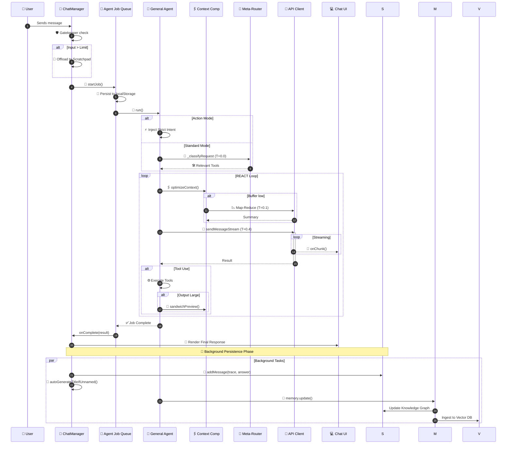

# 🔄 Request Lifecycle & Workflow

This document traces the path of a user request from the moment it leaves the keyboard to final visual rendering.

---

## 🟢 Phase 1: User Input & UI Layer
*Components: `MessageHandler.js` ⮕ `ChatUI.js`*

1.  **⌨️ User Interaction**: Input is captured in the terminal interface.
2.  **🧩 Pill Detection**: Checks for "Action Pills" (user workflows).
3.  **🏷️ Tagging**: Processes inline hashtags (e.g., `#research`).
4.  **⏱️ Timer Init**: A high-precision elapsed timer appears in the UI.

## 🟡 Phase 2: Session & Job Management
*Components: `ChatManager.js` ⮕ `AgentJobManager.js`*

1.  **🛡️ Input Gatekeeper**:
    *   Estimates tokens.
    *   If payload is too large ⮕ 📝 **Offloads to Scratchpad** and injects a `ref:key`.
2.  **🚦 Job Registration**: 
    *   Enforces 10-job concurrency limit.
    *   💾 **Syncs to localStorage** for crash survival.

## 🔵 Phase 3: The Brain (Meta-Routing)
*Components: `GeneralPurposeAgent.js` ⮕ `Router.js`*

1.  **🧭 Intent Discovery**: Lightweight call at **Temp 0.0**.
2.  **🛠️ Schema Pruning**:
    *   Filters 40+ tools down to 5-10 relevant ones.
    *   📉 **Reduces token noise** and hallucination risk.

## 🟣 Phase 4: The Worker (REACT Loop)
*Components: `GeneralPurposeAgent.js` ⮕ `ContextCompressor.js`*

1.  **🤔 Reasoning**: Agent analyzes context and formulates a plan.
2.  **🖇️ Context Tuning**:
    *   Triggers **Atomic Compression** on giant messages.
    *   Inlines conversation summaries if the window is cramped.
3.  **⚙️ Multi-Action**: Executes tools (Parallelized when possible).
4.  **🥪 Output Guard**: Large tool results are "Sandwiched" before returning to the loop.

## 🟠 Phase 5: Rendering & Finalization
*Components: `ChatUI.js` ⮕ `APIClient.js` ⮕ `SessionStorage.js`*

1.  **📡 Streaming**: Incremental markdown rendering with syntax highlighting.
2.  **🎨 Multimodal Display**:
    *   🖼️ **Images**: Lightbox support.
    *   📊 **Charts**: Live Chart.js visualization.
3.  **🕵️ Trace Viewer**: 
    *   **On-Demand Loading**: Large `agent_trace` payloads are excluded from session load and fetched only when "Trace" is clicked.
4.  **⚡ Non-Blocking Exit**:
    *   **Memory Ingestion**: `Memoria.update()` runs in the background.
    *   **DB Persistence**: Message saving and title generation are backgrounded, allowing the UI to stay responsive.

---

## 📉 Workflow Sequence Diagram

---

## 📡 Live Telemetry Feedback
The Agent provides real-time "Thought Stream" updates to the user:
*   **Step 1**: "Analyzing request & architecting strategy..."
*   **Step 2**: "Routing intent to [Category] tools..."
*   **Step 3**: "Interrogating [External Source]..."
*   **Step 4**: "Synthesizing final intelligence..."
