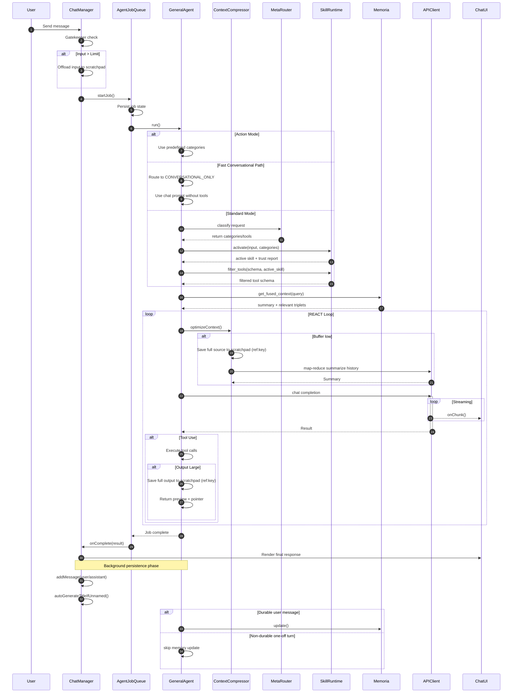

# 🔄 Request Lifecycle & Workflow

This document traces the path of a user request from the moment it leaves the keyboard to final visual rendering.

---

## 🟢 Phase 1: User Input & UI Layer
*Components: `cli/cowork/main.py` ⮕ `cli/cowork/ui.py`*

1.  **⌨️ User Interaction**: Input is captured in the terminal interface.
2.  **🧩 Pill Detection**: Checks for "Action Pills" (user workflows).
3.  **🏷️ Tagging**: Processes inline hashtags (e.g., `#research`).
4.  **⏱️ Timer Init**: A high-precision elapsed timer appears in the UI.

## 🟡 Phase 2: Session & Job Management
*Components: `cli/cowork/main.py` ⮕ `cli/cowork/config.py` (`JobManager`)*

1.  **🛡️ Input Gatekeeper**:
    *   Estimates tokens.
    *   If payload is too large ⮕ 📝 **Offloads to Scratchpad** and injects a `ref:key`.
2.  **🚦 Job Registration**: 
    *   Enforces 10-job concurrency limit.
    *   💾 **Syncs to `~/.cowork/jobs.json`** for crash survival.

## 🟤 Phase 2.5: Plan-then-Execute (The Planner)
*Components: `cli/cowork/agent.py` (`GeneralPurposeAgent._plan_phase`) ➝ `cli/cowork/prompts.py` (`PLANNER_SYSTEM_PROMPT`)*

> **Inspired by**: Erdogan et al. 2025 — *"Plan-and-Act: Improving Planning of Agents for Long-Horizon Tasks"* (ICML 2025, arXiv:2503.xxxxx); GoalAct (arXiv 2504.xxxxx, 2025); “Plan-Then-Execute: An Empirical Study of User Trust” (arXiv 2502.01xxx, 2025).

Before the REACT loop begins, a lightweight **Planner LLM call** runs at **Temp 0.1** to generate a structured, high-level execution plan:

1.  **🧠 Plan Generation** (T=0.1, JSON output):
    *   Receives: user request, available tool names, memory context, scratchpad state.
    *   Produces a JSON plan: `goal`, `complexity` (simple / moderate / complex), and an ordered list of `steps`.
    *   Each step has: `tool`, `action`, `rationale`, `expected_output`, `depends_on`, `can_parallelize`.
2.  **⚡ Bypass Conditions** (no extra latency when skipped):
    *   `CONVERSATIONAL_ONLY` turns — no plan needed.
    *   `action_mode` fast-track — intent already known.
    *   `plan_then_execute: false` in config — reverts to pure REACT.
    *   Planner decides `complexity: simple` with a single `direct_answer` step — injects "no plan needed" sentinel.
3.  **📌 Plan Injection**: The plan is rendered as a `[EXECUTION PLAN]` block injected into the agent system prompt — every REACT step sees the strategic roadmap.
4.  **💾 Plan Persistence**: The JSON plan is saved to `scratchpad["current_execution_plan"]` for cross-turn continuity.
5.  **🛡️ Graceful Degradation**: If the planner LLM call fails, the agent silently falls back to the standard pure-REACT mode without surfacing the error to the user.

### Why This Matters
- **Fixes reactive drift**: Without a plan, the REACT loop can wander, waste steps, or get stuck in local minima.
- **Improves step budget efficiency**: The executor knows what remains, preventing redundant tool calls.
- **Better parallelism**: `can_parallelize` hints allow the executor to batch independent steps.
- **User trust**: The plan is visible in the trace viewer, so users can verify the strategy before execution.

## 🔵 Phase 3: The Brain (Meta-Routing)
*Components: `cli/cowork/agent.py` ⮕ `cli/cowork/router.py` ⮕ `cli/cowork/skills/runtime.py`*

1.  **🧭 Intent Discovery**: Run lightweight classification at **Temp 0.0**.
    *   **Session-context-aware routing**: For short follow-up inputs (< 120 chars) in sessions with prior messages, the agent prepends a compact context hint from the last 2 turns so the router can understand the follow-up in context (e.g., user providing an email address after being asked "who should I send this to?").
    *   **Data-value detection**: The fast-path probability estimator detects email addresses, URLs, and file paths — these are routed through the full LLM classifier to avoid being misclassified as conversational.
2.  **🧯 Fallback Routing**: If routing/model parsing fails, use keyword fallback categories.
3.  **🧩 Skill Activation (Progressive Disclosure)**:
    *   Builds an always-on `[SKILL LIBRARY METADATA]` table-of-contents.
    *   Selects at most one active skill from input + routed categories.
    *   **Always injects the activated skill's own `tool_categories`** into the routed category set, ensuring the skill's tools are loaded regardless of whether the router included that category.
    *   Applies trust gates (static analysis, semantic alignment, manifest validity).
    *   Loads full `SKILL.md` body/resources only when trust checks pass.
4.  **🛠️ Schema Pruning**:
    *   `CONVERSATIONAL_ONLY` ⮕ no tool schema construction.
    *   Tool-capable turns ⮕ filter to relevant categories, then apply skill trust-tier and manifest constraints.
    *   **Domain-scoped filtering**: Skill tier-based safety filters (mutation blockers, network blockers) and `allowed_tools` restrictions apply **only to tools within the skill's own categories**. Tools from other domains (e.g., weather, email) pass through untouched so multi-domain requests work correctly.
    *   If skill filtering yields zero tools, runtime falls back to routed schema to avoid dead-ends.

## 🟣 Phase 4: The Worker (Memory Read + REACT Loop)
*Components: `cli/cowork/agent.py` (`GeneralPurposeAgent` + `ContextCompressor`)*

1.  **🧩 Prompt Split**:
    *   `AGENT_CHAT_SYSTEM_PROMPT` for conversational-only turns.
    *   `AGENT_SYSTEM_PROMPT` for workflow/tool turns.
2.  **🧠 Memory Retrieval**:
    *   Loads fused context from Memoria before the first reasoning call.
    *   Retrieval uses semantic + topical gates and a recent-memory fallback for low-signal turns.
3.  **🤔 Reasoning**: Agent analyzes context and formulates a plan.
3b. **🔄 System Message Consolidation**: Before each LLM call, all `role: system` messages are merged into a single entry at the top of the context. This prevents multi-system-message issues with certain LLM providers.
4.  **🖇️ Context Tuning**:
    *   If context is oversized, the full compressible source is first archived to scratchpad with a named `ref:key`.
    *   Then Map-Reduce summarization runs and injects `[CONVERSATION SUMMARY]` with `Source archived at ref:...`.
    *   Existing `[CONVERSATION SUMMARY]` blocks are excluded from future compression input (prevents summary-of-summary loops).
5.  **⚙️ Multi-Action**: Executes tools (Parallelized when possible).
6.  **🥪 Output Guard**:
    *   Large tool results are archived to scratchpad first, then returned as sandwich preview + `ref:key`.
    *   Already archived outputs (`[Full result saved as ref:...]`) are not re-compressed.
7.  **🧾 Step Intersection Reflection (Critical)**:
    *   After each tool batch, the agent creates a compact structured assessment per tool:
        * `tool`
        * `status` (`ok` / `partial` / `error` / `blocked`)
        * `finding`
        * `next_action`
    *   The assessment is injected as a `[TOOL REFLECTION]` system note before the next LLM step.
    *   A rolling `run_step_ledger` is persisted in scratchpad for continuity during the same run.

### 🧠 Why This Phase Matters
- The next reasoning step should not rely on raw tool text alone.
- Structured reflection provides a stable "state transition" between steps.
- This reduces repeated tool loops and improves tool-to-tool planning quality.

## 🟠 Phase 5: Rendering & Finalization
*Components: `cli/cowork/ui.py` ⮕ `cli/cowork/api_client.py` ⮕ `cli/cowork/config.py` (`Session`)*

1.  **📡 Streaming**: Incremental markdown rendering with syntax highlighting.
2.  **🎨 Multimodal Display**:
    *   🖼️ **Images**: Lightbox support.
    *   📊 **Charts**: Live Chart.js visualization.
3.  **🕵️ Trace Viewer**: 
    *   **On-Demand Loading**: Large `agent_trace` payloads are excluded from session load and fetched only when "Trace" is clicked.
4.  **⚡ Non-Blocking Exit**:
    *   **Memory Ingestion**: `Memoria.update()` is called only for durable user turns.
    *   **DB Persistence**: Message saving and title generation are backgrounded, allowing the UI to stay responsive.

### 🚨 Step-Limit Status Contract
- `✅ GOAL ACHIEVED` / `⚠️ GOAL PARTIALLY ACHIEVED` / `❌ GOAL NOT ACHIEVED` banners are used **only** for step-limit self-assessment turns.
- Normal conversational/tool turns should return direct answers without the banner.

---

## 📉 Workflow Sequence Diagram

```mermaid
sequenceDiagram
    autonumber
    participant User as User
    participant CM as ChatManager
    participant JobMgr as AgentJobQueue
    participant Agent as GeneralAgent
    participant Comp as ContextCompressor
    participant Router as MetaRouter
    participant Skills as SkillRuntime
    participant Mem as Memoria
    participant API as APIClient
    participant UI as ChatUI

    User->>CM: Send message

    CM->>CM: Gatekeeper check
    alt Input > Limit
        CM->>CM: Offload input to scratchpad
    end

    CM->>JobMgr: startJob()
    JobMgr->>JobMgr: Persist job state

    JobMgr->>Agent: run()

    alt Action Mode
        Agent->>Agent: Use predefined categories
    else Fast Conversational Path
        Agent->>Agent: Route to CONVERSATIONAL_ONLY
        Agent->>Agent: Use chat prompt without tools
    else Standard Mode
        Agent->>Router: classify request
        Router-->>Agent: return categories/tools
        Agent->>Skills: activate(input, categories)
        Skills-->>Agent: active skill + trust report
        Agent->>Skills: filter_tools(schema, active_skill)
        Skills-->>Agent: filtered tool schema
    end

    Agent->>Mem: get_fused_context(query)
    Mem-->>Agent: summary + relevant triplets

    loop REACT Loop
        Agent->>Comp: optimizeContext()
        alt Buffer low
            Comp->>Comp: Save full source to scratchpad (ref:key)
            Comp->>API: map-reduce summarize history
            API-->>Comp: Summary
        end

        Agent->>API: chat completion
        activate API
        loop Streaming
            API-->>UI: onChunk()
        end
        API-->>Agent: Result
        deactivate API

        alt Tool Use
            Agent->>Agent: Execute tool calls
            alt Output Large
                Agent->>Agent: Save full output to scratchpad (ref:key)
                Agent->>Agent: Return preview + pointer
            end
        end
    end

    Agent-->>JobMgr: Job complete
    JobMgr->>CM: onComplete(result)
    CM->>UI: Render final response

    Note over CM,Agent: Background persistence phase
    CM->>CM: addMessage(user/assistant)
    CM->>CM: autoGenerateTitleIfUnnamed()
    alt Durable user message
        Agent->>Mem: update()
    else Non-durable one-off turn
        Agent->>Agent: skip memory update
    end
```

---

## 📡 Live Telemetry Feedback
The Agent provides real-time "Thought Stream" updates to the user:
*   **Step 1**: "Analyzing request & architecting strategy..."
*   **Step 2**: "Routing intent to [Category] tools..."
*   **Step 3**: "Interrogating [External Source]..."
*   **Step 4**: "Synthesizing final intelligence..."
