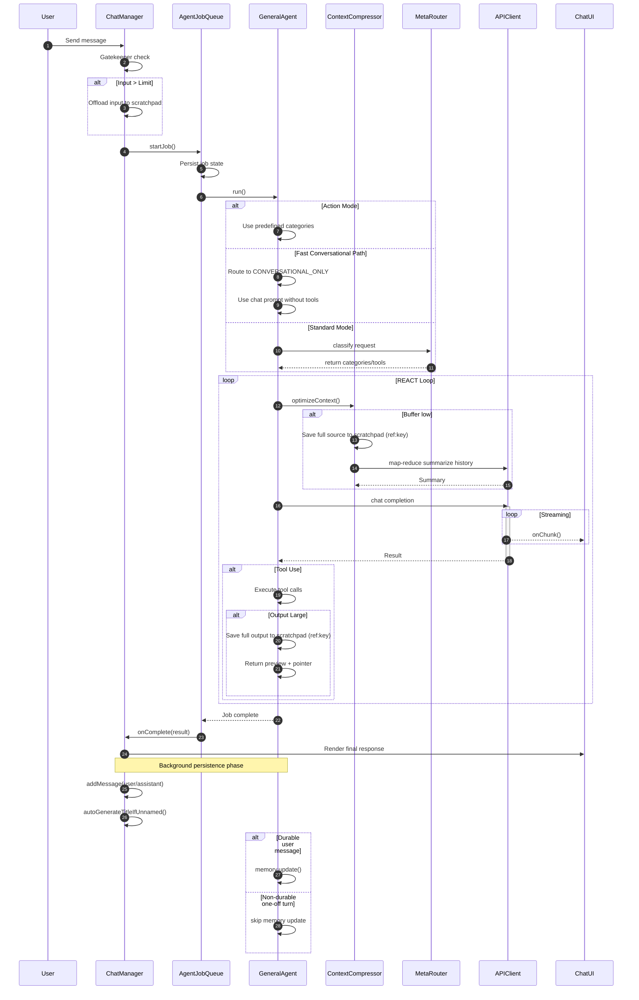

# 🔄 Request Lifecycle & Workflow

This document traces the path of a user request from the moment it leaves the keyboard to final visual rendering.

---

## 🟢 Phase 1: User Input & UI Layer
*Components: `cli/cowork/main.py` ⮕ `cli/cowork/ui.py`*

1.  **⌨️ User Interaction**: Input is captured in the terminal interface.
2.  **🧩 Pill Detection**: Checks for "Action Pills" (user workflows).
3.  **🏷️ Tagging**: Processes inline hashtags (e.g., `#research`).
4.  **⏱️ Timer Init**: A high-precision elapsed timer appears in the UI.

## 🟡 Phase 2: Session & Job Management
*Components: `cli/cowork/main.py` ⮕ `cli/cowork/config.py` (`JobManager`)*

1.  **🛡️ Input Gatekeeper**:
    *   Estimates tokens.
    *   If payload is too large ⮕ 📝 **Offloads to Scratchpad** and injects a `ref:key`.
2.  **🚦 Job Registration**: 
    *   Enforces 10-job concurrency limit.
    *   💾 **Syncs to localStorage** for crash survival.

## 🔵 Phase 3: The Brain (Meta-Routing)
*Components: `cli/cowork/agent.py` ⮕ `cli/cowork/router.py`*

1.  **⚡ Fast-Path Detection**: Short conceptual turns can skip full router and route directly to `CONVERSATIONAL_ONLY`.
2.  **🧭 Intent Discovery**: If not fast-pathed, run lightweight classification at **Temp 0.0**.
3.  **🛠️ Schema Pruning**:
    *   `CONVERSATIONAL_ONLY` ⮕ no tool schema construction.
    *   Tool-capable turns ⮕ filter to relevant categories.
4.  **🎚️ Router Calibration**:
    *   A tool-need probability score can downgrade a broad route to `CONVERSATIONAL_ONLY`.
    *   📉 Reduces unnecessary orchestration and latency.

## 🟣 Phase 4: The Worker (REACT Loop)
*Components: `cli/cowork/agent.py` (`GeneralPurposeAgent` + `ContextCompressor`)*

1.  **🧩 Prompt Split**:
    *   `AGENT_CHAT_SYSTEM_PROMPT` for conversational-only turns.
    *   `AGENT_SYSTEM_PROMPT` for workflow/tool turns.
2.  **🤔 Reasoning**: Agent analyzes context and formulates a plan.
3.  **🖇️ Context Tuning**:
    *   If context is oversized, the full compressible source is first archived to scratchpad with a named `ref:key`.
    *   Then Map-Reduce summarization runs and injects `[CONVERSATION SUMMARY]` with `Source archived at ref:...`.
    *   Existing `[CONVERSATION SUMMARY]` blocks are excluded from future compression input (prevents summary-of-summary loops).
4.  **⚙️ Multi-Action**: Executes tools (Parallelized when possible).
5.  **🥪 Output Guard**:
    *   Large tool results are archived to scratchpad first, then returned as sandwich preview + `ref:key`.
    *   Already archived outputs (`[Full result saved as ref:...]`) are not re-compressed.
6.  **🧾 Step Intersection Reflection (Critical)**:
    *   After each tool batch, the agent creates a compact structured assessment per tool:
        * `tool`
        * `status` (`ok` / `partial` / `error` / `blocked`)
        * `finding`
        * `next_action`
    *   The assessment is injected as a `[TOOL REFLECTION]` system note before the next LLM step.
    *   A rolling `run_step_ledger` is persisted in scratchpad for continuity during the same run.

### 🧠 Why This Phase Matters
- The next reasoning step should not rely on raw tool text alone.
- Structured reflection provides a stable "state transition" between steps.
- This reduces repeated tool loops and improves tool-to-tool planning quality.

## 🟠 Phase 5: Rendering & Finalization
*Components: `cli/cowork/ui.py` ⮕ `cli/cowork/api_client.py` ⮕ `cli/cowork/config.py` (`Session`)*

1.  **📡 Streaming**: Incremental markdown rendering with syntax highlighting.
2.  **🎨 Multimodal Display**:
    *   🖼️ **Images**: Lightbox support.
    *   📊 **Charts**: Live Chart.js visualization.
3.  **🕵️ Trace Viewer**: 
    *   **On-Demand Loading**: Large `agent_trace` payloads are excluded from session load and fetched only when "Trace" is clicked.
4.  **⚡ Non-Blocking Exit**:
    *   **Memory Ingestion**: `Memoria.update()` is called only for durable user turns.
    *   **DB Persistence**: Message saving and title generation are backgrounded, allowing the UI to stay responsive.

### 🚨 Step-Limit Status Contract
- `✅ GOAL ACHIEVED` / `⚠️ GOAL PARTIALLY ACHIEVED` / `❌ GOAL NOT ACHIEVED` banners are used **only** for step-limit self-assessment turns.
- Normal conversational/tool turns should return direct answers without the banner.

---

## 📉 Workflow Sequence Diagram

---

## 📡 Live Telemetry Feedback
The Agent provides real-time "Thought Stream" updates to the user:
*   **Step 1**: "Analyzing request & architecting strategy..."
*   **Step 2**: "Routing intent to [Category] tools..."
*   **Step 3**: "Interrogating [External Source]..."
*   **Step 4**: "Synthesizing final intelligence..."
