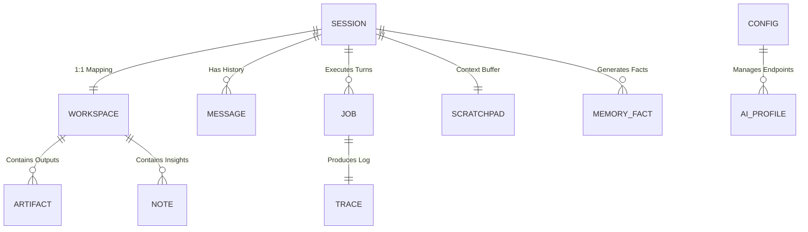

# 11. Concept & Data Relationships

This document defines the relational architecture between Cowork's core concepts. Although the system uses the filesystem (JSON/YAML/Markdown) as its primary storage engine, the relationships follow strict database-like normalization and cascading rules.

## 🗺️ Entity-Relationship Overview

---

## 🏗️ Core Concept "Schema"

### 1. The Session (Identity)
The **Session** is the primary key for any conversation loop. It represents the "Who" and "When".
* **Key ID**: `session_id` (UUID)
* **Relations**:
    * **Workspace**: Strictly 1:1. A session *must* have a workspace folder for production.
    * **Jobs**: 1:N. Every time you send a message, a new `Job` is created to handle the agentic task.
    * **Messages**: 1:N list of JSON objects (role, content, timestamp).

### 2. The Workspace (Human-Readability)
The **Workspace** is the filesystem manifestation of a Session. It is designed to be browsed by a human in a code editor.
* **Key ID**: `slug` (Human-readable title e.g. `web-scraping-bot-v2`)
* **Linking**: Uses `workspace_slug` in the session data and `session_id` in the `session.json` metadata found inside the workspace.
* **Cascade Behavior**: 
    * Deleting a Workspace folder triggers a search for the linked Session file to delete it.
    * Renaming a Session title triggers a folder rename (slug update).

### 3. The Scratchpad (Contextual Pointer)
The **Scratchpad** acts as an "Extended Buffer" for the Session.
* **Relationship**: Linked to `session_id`.
* **Purpose**: Offloads large logs, code snippets, or data payloads so they don't bloat the `MESSAGE` array (and hit token limits).
* **Storage**: Historically `~/.cowork/scratchpad/`, but now physically localized inside the `workspace/<slug>/scratchpad/` sub-folder for better portability.

### 4. Memoria (The Knowledge Layer)
Memoria splits into two relational tiers:
* **Short-Term Context**: (1:1 with Session) A Map-Reduce summary of the current chat.
* **Long-Term Knowledge Graph**: (N:N with Global Persona) Atomic triplets `[Subject] -> [Predicate] -> [Object]`. 
    * While triplets are global, they often track the `session_id` of origin to allow the AI to "trace back" where a fact was learned.

### 5. Jobs & Traces (Execution Layer)
* **Job**: A transient unit of work (one turn). Tracks meta-routing categories, token usage, and step counts.
* **Trace**: A granular event log (1:1 with Job). Contains the exact tool arguments, raw LLM reasoning, and timing metrics.

---

## 🔄 Lifecycle & Cascading Logic

Cowork enforces strict referential integrity across the filesystem:

| UI Action | Effect on Session File | Effect on Workspace Folder | Effect on Memory |
| :--- | :--- | :--- | :--- |
| **`/new`** | Creates `[SID].json` | Creates `workspace/[slug]/` | Initializes Summary |
| **`/sessions rm`** | **DELETED** | **DELETED** (Cascade) | Preserved (Persona) |
| **Title Change** | `title` updated | Folder Renamed (Slug update) | Updated in Context |
| **Empty Clean** | Deleted if `msgs == 0` | Deleted if no artifacts | N/A |

## 📂 Physical Path Mapping

| Concept | Logical Path | Persistence Strategy |
| :--- | :--- | :--- |
| **Primary Metadata** | `~/.cowork/sessions/[SID].json` | JSON Object |
| **User Output** | `~/.cowork/workspace/[slug]/artifacts/` | Raw Files (PDF/JS/PY) |
| **LLM Reasoning** | `~/.cowork/workspace/[slug]/context.md` | Living Markdown |
| **Semantic Facts** | `~/.cowork/memoria/knowledge.db` | SQLite / Vector Index |
| **Operational State** | `~/.cowork/jobs.json` | Transient JSON Registry |
