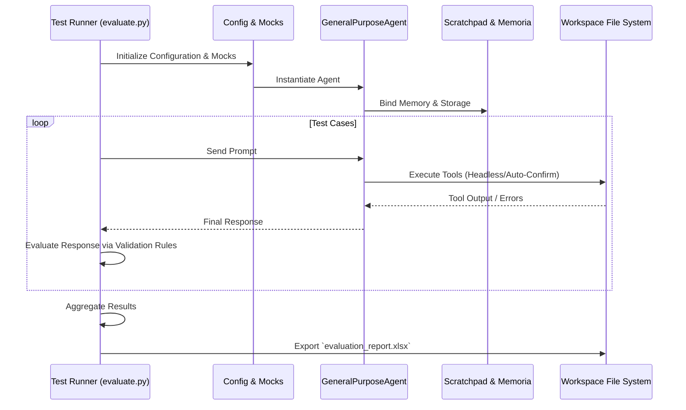

# 🧪 Cowork Agentic Evaluation Architecture

## Overview
This document outlines the testing architecture for evaluating the **Cowork AI Agent**. The tests validate core agentic capabilities, preventing regressions in fundamental reasoning, memory, tool usage, and error handling.

## 🏗️ Architecture Diagram
The following sequence diagram illustrates how tests interact with the core Cowork framework in a headless manner:



## 📋 Testing Rules & Guidelines

1. **Isolated State:** Each test case MUST run in an isolated session (`Session(title=...)`) to prevent memory bleeding across evaluations.
2. **Headless Execution:** Tools must be executed with a mock `confirm_cb` that automatically returns `True` to allow unattended test runs and evaluate automated safety boundaries.
3. **No Mocks for Core Logic:** Do not mock the LLM models, the router, or reasoning engines. The tests validate the orchestration and the actual LLM outputs.
4. **Verifiable Outcomes:** Every test case must have a precise, deterministic validation constraint (e.g., regex matching on response string, or physical file presence verification).
5. **Idempotency & Cleanup:** File system operations created by tests must be wiped after the fact to maintain a clean environment.

## 📊 Test Categories

| Category | Description | Validation Focus | Example |
| :--- | :--- | :--- | :--- |
| **Tool Call & File Operations** | Validate agent's ability to natively execute file/OS tools reliably. | Parameter extraction, file I/O operations. | Checking file creation and content hash. |
| **React On Error** | Evaluate how the agent recovers from missing resources or execution crashes. | Self-correction, graceful error handling. | Dealing with attempts to read a nonexistent UNIX path. |
| **Memory Management** | Ensure data ingestion, retrieval, and long-term storage function across interactions. | Cross-turn profile mapping and DB IO. | Multi-turn prompt recollection of a secret string. |
| **AI Hallucination** | Check if the agent fabricates capabilities or outputs when boundaries dictate refusal. | Strict constraints logic, factual safety. | Refusing to name the "capital" of the moon. |
| **AI Reasoning & Planning** | Validate structured chain-of-thought and logic execution steps. | Semantic task breakdown, mathematics. | Emitting correct logical math sequences. |

## ➕ Adding New Tests
To add a new test, extend the `TEST_CASES` list inside `tests/evaluate.py`:
```python
{
    "category": "New Category",
    "name": "Specific Behavior",
    "prompts": ["Prompt part 1", "Follow-up prompt 2"],
    "verify": lambda response, context: "expected word" in response.lower(),
}
```
This guarantees an easily extensible evaluation matrix, directly exportable to professional formats (Excel).
